## V8引擎

### V8引擎的原理

1. 经过Parse模块将js代码转成AST树结构
2.  经过ignition转成字节码
3. 最后转成机器码

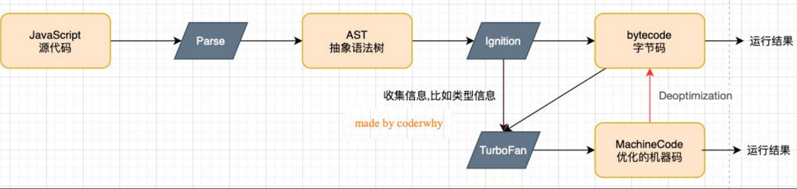


## JS执行过程

- 初始化全局对象

  执行代码前，JS会在堆内存创建一个全局对象（Global Object）

  该全局对象，全部的作用域（scope）都可以访问

### 执行上下文栈（调用栈）

执行上下文栈（Execution Context Stack，简称ECS）

代码执行时，会构建一个`全局执行上下文`（Global Execution Context（GEC））

GEC会放入ECS中

- 将定义的变量加入GO（undefined），将定义的函数加入GO（指向地址）
- 接着按顺序对变量赋值，执行函数

遇到函数时，会创建一个`函数执行上下文`（Functional Execution Context，
简称FEC）并一并放入ECS中，函数执行完毕，函数执行上下文会销毁

- 创建一个Activation Object（AO），包含形参、arguments、定义的函数、变量
- 作用域链，包含了自己的AO、父级的AO，一直往上包含到GO
- 绑定的this值


## 作用域链

作用域链，包含了自己的AO、父级的AO，一直往上包含到GO

函数的作用域链，在函数定义时就决定好了，而和调用的位置无关，和this也无关

PS：this和作用域链

```js
const msg = "hello global";

const foo = () => console.log(msg); //hello global

const bar = () => {
  const msg = "hello bar";
  foo();
};

bar();
```

```js
const msg = "hello global";

const foo = function () {
  console.log(msg); //hello global
};

const bar = {
  msg: "1111",
};

foo.call(bar);
```


## 垃圾回收

### 引用计数

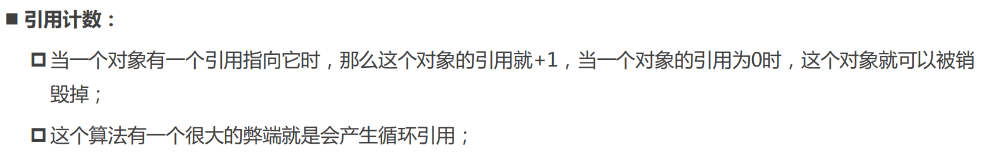

### 标记清除

JS广泛使用标记清除（V8）

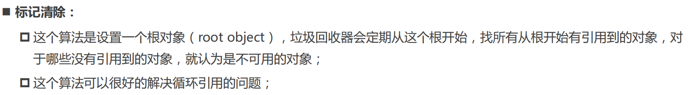

### 手动清除

```js
obj = null
```


## 闭包

### 实例（高阶函数）

高阶函数是 一个接受另一个函数作为参数，或者返回另一个函数作为返回值的函数

```js
const adder = (count) => (num) => console.log(count + num);

const add5 = adder(5);

add5(10); // 15
add5(20); // 25
add5(100); // 105

const add100 = adder(100);

add100(10); // 110
add100(20); // 120
add100(100); // 200
```

### 概念

闭包是一个函数和它外部可以访问的外层函数作用域的自由变量的两部分的组合

### 闭包的销毁

```js
const foo = () => {
  const age = 18
  const name = 'zwh'
  return () => {
    debugger
    console.log(age)
  }
}

const test = foo()

test()
```

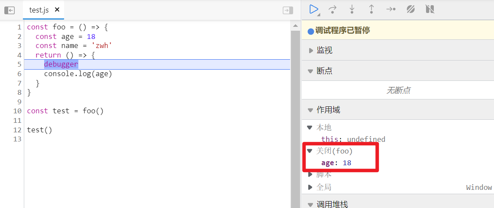

图为闭包保存的变量，规范规定，应该保留foo函数的整个AO（包括name），但实际上V8引擎会优化掉用不掉的name。


## this

### 绑定规则

1. this的绑定和定义的位置无关
2. this的绑定和调用方式和调用位置有关
3. this是在运行时绑定的

```js
const getThis = function () {
  console.log(this)
}

getThis() // Window

const obj = {
  getThis
}

obj.getThis() // {getThis: ƒ}

getThis.apply('这个是this') // String {'这个是this'}
```

### this的指向

- 全局作用域下，this指向window（node指向一个空对象）
- 普通函数直接调用，this指向window（无论嵌套几层），即以foo()格式调用的都是window

```js
const obj = {
  getThis: function () {
    console.log(this)
  }
}

const foo = obj.getThis

foo()
```

- 隐式绑定，this指向obj，即以obj.foo()格式调用的都是obj

```js
const getThis = function () {
  console.log(this)
}

const obj = {
  getThis
}

obj.getThis() // {getThis: ƒ}
```

- 显示绑定1：apply、call，this会变成绑定的第一个参数（不能是null或者undefined，还是window）,只有效一次

```js
// call和bind的区别是apply传参要用[]包起来
const getAge = function (params) {
  console.log(this.age, params)
}

const obj = {
  age: 18
}

getAge.call(obj, '参数') // 18 '参数'
getAge.apply(obj, ['参数']) // 18 '参数'
```

- 显示绑定2：bind，`返回的新函数`，this会变成绑定的第一个参数（不能是null或者undefined，还是window），一直有效，且无法再改变

```js
const getAge = function (params) {
  console.log(this.age, params)
}

const obj = {
  age: 18
}

const foo = getAge.bind(obj, '参数')

foo() // 18 '参数'
foo.call({ age: 20 }) // 18 '参数'，无法改变
```

- new创建一个新对象

  1. 创建一个新对象
  2. 新对象会绑定prototype
  3. 新对象会绑定到函数调用的this上
  4. 如果函数没有返回其他`对象`，会返回这个新对象(即默认返回的this)


- 定时器的this，一般都为window，因为定时器函数定义内部相当于调用了callback()，是`普通函数调用`

```js
var obj = {
  fn: function () {
    var timer = null
    clearInterval(timer)
    timer = setInterval(function () {
      console.log(this) //window
    }, 1000)
  }
}

obj.fn()
```

- 点击事件的this，是元素本身

```js
const box = document.querySelector('#box')

box.onclick = function () {
  console.log(this)  //this
}
```

- 规则之间，还有优先级顺序
  1. new创建对象（高于bind，但不能和call、apply一起使用）
  2. bind(高于call、apply)
  3. call、apply
  4. obj.fn()隐式绑定
  5. foo()普通函数直接调用


## 箭头函数

### this

箭头函数不适用上述的规则，`而是根据外层作用域决定this`

注意，对象内的箭头函数，对象字面量不是外层作用域

```js
const obj = {
  foo() {
    ;(() => {
      console.log(this)
    })()
  },
  bar: () => {
    console.log(this)
  }
}

obj.foo() // obj
obj.bar() // window
```


## JS函数式编程

### 纯函数

React中的类组件、函数组件都应该像纯函数一样

#### 特点

- 相同的输入，一定产生相同的输出
- 函数执行不能产生副作用（修改全局变量、修改参数、修改外部储存等）

#### 示例

slice函数就是一个纯函数，（输入start，end固定的输出，不改变原数组）

```js
const arr = ['a', 'b', 'c', 'd']

console.log(arr.slice(0, 3)) // [ 'a', 'b', 'c' ]
```

而splice因为修改原数组，且固定输入输出也不同，因此不是纯函数

```js
const arr = ['a', 'b', 'c', 'd']

console.log(arr.splice(0, 1)) // ['a']
console.log(arr.splice(0, 1)) // ['b']
console.log(arr.splice(0, 1)) // ['c']
console.log(arr) // ['d']
```

### 柯里化

只传递函数的一部分参数来调用它，让它返回一个函数去处理剩余的参数，这个过程叫柯里化

#### 柯里化的优势 

让一个函数处理的问题尽量单一，而不是将一堆处理过程交给一个函数

因此将每次传入的函数在一个函数中进行处理，然后再下一个函数中使用处理的结果

#### 例子

1、希望将传入第一个数字+2，第二个数字*2，第三个数字平方，最后相加

```js
const handle = a => {
  a = a + 2
  return b => {
    b = b * 2
    return c => {
      c = Math.pow(c, 2)
      return a + b + c
    }
  }
}

console.log(handle(10)(20)(30))
```

2、逻辑复用

```js
const log = date => type => message =>
  `[${date.getHours()}:${date.getMinutes()}][${type}]:[${message}]`

const logNowBug = log(new Date())('DEBUG')

console.log(logNowBug('first error'))
console.log(logNowBug('second error'))
console.log(logNowBug('third error'))

/**
 * [16:14][DEBUG]:[first error]
 * [16:14][DEBUG]:[second error]
 * [16:14][DEBUG]:[third error]
 */
```

#### 柯里化函数的实现

```js
const add = (a, b, c) => a + b + c

function curry(fn) {
  return function curried(...args) {
    // 根据传参的长度和原函数参数的长度比较，如果大于等于，即正常使用(1,2,3)
    if (args.length >= fn.length) {
      return fn.apply(this, args)
    } else {
      // 返回一个新函数接受下一个参数
      return function (...args2) {
        // 递归调用一次curried，拼接上次的参数和新传入的函数
        return curried.apply(this, [...args, ...args2])
      }
    }
  }
}

const fn = curry(add)

console.log(fn(1, 2, 3)) // 6
console.log(fn(1, 2)(3)) // 6
console.log(fn(1)(2)(3)) // 6
```

### 组合函数

```js
const compose = function (...fns) {
  const length = fns.length
  for (let i = 0; i < length; i++) {
    if (typeof fns[i] !== 'function') {
      throw new TypeError('Expected All Arguments Function')
    }
  }
  return function (...args) {
    let index = 0
    let result = length ? fns[index].apply(this, args) : args
    while (++index < length) {
      result = fns[index].call(this, result)
    }
    return result
  }
}

const double2 = num => num * 2
const add2 = num => num + 2

console.log(compose(add2, double2)(1)) // 6
console.log(compose(add2, double2)(2)) // 8
console.log(compose(add2, double2)(3)) // 10
```


## 严格模式

### 开启

代码开头添加'use strict'，但只对这个文件生效

```
'use strict'
```

### 用处

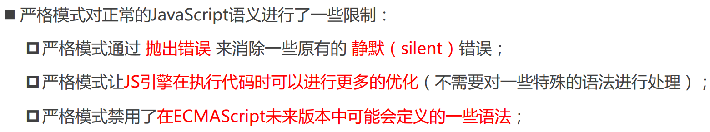

### 常见错误

第八条，即以foo()形式调用的，this不再指向window，而是undefined

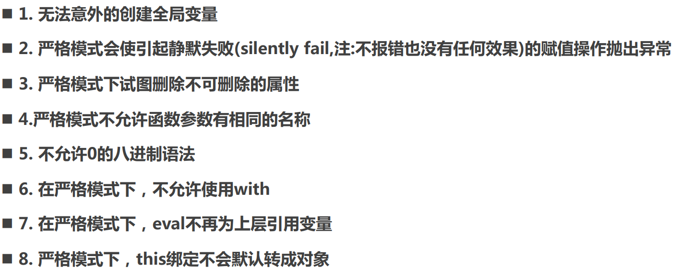


## 面向对象

### 面向对象三大特性


### Object.defineproperty

会在对象上定义一个新属性，或修改一个对象的现有属性，并返回这个对象

#### 数据属性描述符

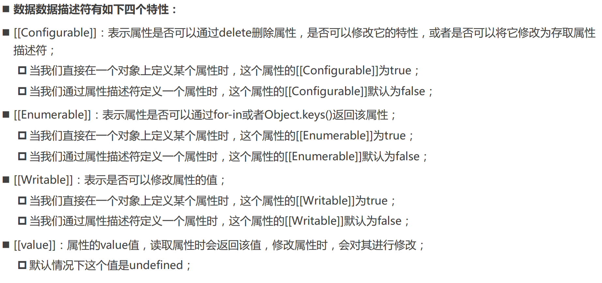

#### 存取属性描述符

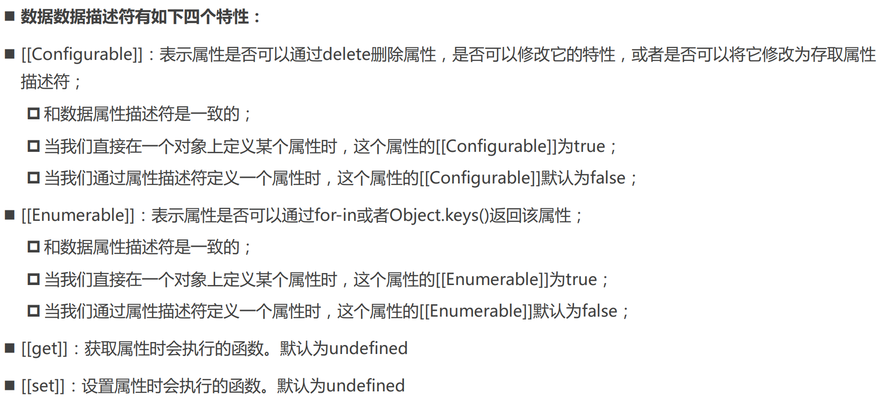

```js
const obj = {
  _age: 18
}

Object.defineProperty(obj, 'age', {
  get() {
    return this._age + 10
  },
  set(value) {
    this._age = value
  }
})

console.log(obj.age) // 28
obj.age = 20
console.log(obj.age) // 30
```

#### 快速写法

```js
const obj = {
  _age: 20,
  get age() {
    return this._age
  },
  set age(value) {
    this._age = value
  }
}

console.log(obj._age) // 20
obj.age = 30
console.log(obj._age) // 30

//和Object.defineProperty的写法是一样的
```

### Object.defineProperties

```js
const obj = {
  _age: 18
}

Object.defineProperties(obj, {
  age: {
    get() {
      return this._age + 10
    },
    set(value) {
      this._age = value
    }
  }
})

console.log(obj.age) // 28
obj.age = 50
console.log(obj.age) // 60
```

### 获取属性描述符

```js
console.log(Object.getOwnPropertyDescriptor(obj, 'age'))

/**
 * {
 * get: [Function: get age],
 * set: [Function: set age],
 * enumerable: true,
 * configurable: true
 * }
 */
```

### 对象的限制方法

```js
// 阻止添加新属性
Object.preventExtensions(obj)

// 禁止对象删除属性
Object.seal(obj)

// 禁止对象修改一切属性
Object.freeze(obj)
```

### `new操作符的作用`

1. 创建一个新的对象
2. 该对象的隐式原型会被赋值为该构造函数的显式原型prototype属性
3. 构造函数内部的this会指向新创建的对象
4. 执行函数的内部代码
5. 如果构造函数没有返回非空对象，则返回创建的对象

### 构造函数

```js
function Person(name) {
  this.name = name
  this.getName = function () {
    console.log(this.name)
  }
}

const p1 = new Person('zwh')
const p2 = new Person('li')

p1.getName()
p2.getName()

console.log(p1.getName === p2.getName)
```

### 原型

- 每个对象都有一个隐式原型，可以用\_\_proto\_\_或者Object.getPrototypeOf(obj)获取
- 获取对象的一个属性时，如果没有获取到，会沿着隐式原型去找这个属性
- 对象的原型（\_\_proto__）=对象的构造函数的原型（prototype）
- 构造函数的原型prototype有一个不可枚举的属性constructor，指向构造函数本身

### 优化构造函数

把公用的函数加到原型上，可以减少重复函数的创建

```js
function Person(name) {
  this.name = name
}

Person.prototype.getName = function () {
  console.log(this.name)
}

const p1 = new Person('zwh')
const p2 = new Person('li')

p1.getName()
p2.getName()

console.log(p1.getName === p2.getName)
```

### 原型链

- 从对象获取属性时，如果没有获取到，会到对象的隐式原型去获取，如果还没有会继续往上到隐式原型获取，直到最顶层Object的显示原型的隐式原型（Object.prototype.\_\_proto\_\_=null)

- Object.prototype是Object的显式原型，也是所有构造函数（自建构造函数/Date类等）的父类，Object.prototype有一些不可枚举的属性和方法（valueOf、stringOf）

  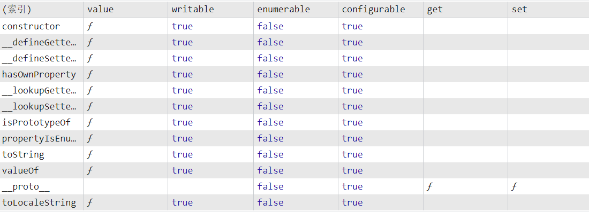

- 这个搜索的过程就叫做原型链


### 继承

#### 构造函数继承（第一种（有弊端））

```js
// 父类
function People() {
  this.name = name
}
People.prototype.getName = function () {
  console.log(this.name)
}
```

```js
// 继承
Student.prototype = new People()
```

```js
// 子类1
function Student() {
  this.sId = '123'
}
Student.prototype.study = function () {
  console.log(this.sId, '正在学习..')
}

const s1 = new Student()

s1.getName() // zwh
s1.study() // 123 正在学习..
```

##### 弊端

- Student对象，一些属性看不到（name属性）
- 父类的（People）引用属性是公用的，进行修改会互相影响
- 传参很难

#### 借用构造函数继承（第二种（有弊端））

相当于把父类的操作都直接加到了子类

```js
function People(name) {
  this.name = name
}
People.prototype.getName = function () {
  console.log(this.name)
}

Student.prototype = new People()

function Student(name, sId) {
  People.call(this, name)
  this.sId = sId
}
Student.prototype.study = function () {
  console.log(this.sId, '正在学习..')
}

const s1 = new Student('xue', '234')

s1.getName() // xue
s1.study() // 234 正在学习..
```

##### 弊端

- 父类的属性都是undefined，因为继承时没有传参
- 继承会调用1次父类构造函数，每次创建子类也会调用一次父类构造函数

### 寄生组合式继承（第三种（完美））

子类需要一个原型对象，该原型又指向父类的原型

使用objectCreate解决了上述缺点，同时用constructor改变子类的类型

```js
function objectCreate(prototype) {
  const Fn = function () {}
  Fn.prototype = prototype
  return new Fn()
}

// objectCreate也可以用Object.create替代，效果一样，objectCreate为兼容性考虑
function inheritPrototype(parent, child) {
  child.prototype = objectCreate(parent.prototype)
  Object.defineProperty(child.prototype, 'constructor', {
    enumerable: false,
    configurable: true,
    value: Student,
    writable: true
  })
}
```

```js
function People(name) {
  this.name = name
}
inheritPrototype(People, Student)

function Student(name) {
  People.call(this, name)
}
const s1 = new Student('xue')

console.log(s1)  // Student { name: 'xue' }
```

### 判断方法

#### hasOwnProperty

判断是否对象`自身`有该属性

```js
const parent = { a: 1 }

const child = Object.create(parent)

console.log(child) // {}
console.log(child.hasOwnProperty('a')) // false
child.a = 2
console.log(child.hasOwnProperty('a')) // true
```

#### in

判断`对象或对象的原型`是否有该属性

```js
const parent = { a: 1 }

const child = Object.create(parent)

console.log('a' in child) // true
```

#### instanceof

构造函数的 prototype 属性是否出现在某个实例对象的原型链上。

```js
function Robot() {}

function People() {}

inheritPrototype(People, Student)

function Student() {}

const s1 = new Student()

console.log(s1 instanceof Student) // true
console.log(s1 instanceof People) // true
console.log(s1 instanceof Object) // true
console.log(s1 instanceof Robot) // false
```

### 总结

```js
const Person = function () {}

// 函数相当于以new Function创建的，有prototype属性的同时还有__proto__属性
// Person.__proto__ = { constructor: Function }  Person.prototype = { constructor: Person }
// Function构造函数又有自己的prototype Function.prototype = { constructor: Function }
console.log(Person.__proto__ === Function.prototype)

// 而Function构造函数原型对象又相当于Object构造函数创建的对象，有自己的隐式对象Function.prototype.__proto__
// Function.prototype.__proto__ = { constructor: Object}
console.log(Object.prototype === Function.prototype.__proto__)

// 而Object隐式原型对象，又是Function构造函数创建的
// Object.__proto__ = { Function: Object }
console.log(Object.__proto__ === Function.prototype)

// 最后Function构造函数原型对象，又有特殊的隐式原型，为null
console.log(Object.prototype.__proto__ === null)
```


## ES6-ES12

### `ES6↓`

### class定义类

- 访问器方法
- 静态方法在编译时就加载了，而实例方法是实例化后加载，在调用静态方法时还没实例化，所以静态方法`不能调用`实例方法和属性，而反之`实例方法`可以同时调用实例方法和属性，静态方法和属性
- 静态方法可以直接类名.方法名或者对象名.方法名调用；实例方法只能实例化后，通过对象名.方法名调用。
- 子类用this之前必须先调用super()，super可以调用父类的constructor，也可以调用父类的方法

```js
class Person {
  constructor(name) {
    this.name = name
    this._address = '上海'
  }
  // 访问器方法
  get address() {
    return this._address + '市'
  }
  set address(value) {
    this._address = value
  }
  //静态方法
  static getRandom() {
    return Math.floor(Math.random() * 10)
  }
}

// 静态方法只能通过类名.方法名调用
// s1.getRandom()  // s1.getRandom is not a function
const arr = Array.from({ length: 20 }, Person.getRandom)
console.log(arr) // [4, 1, 5, 7, 6, 6, 4, 1, 9, 2, 7, 2, 1, 6, 9, 7, 7, 2, 3, 8]
```

```js
class Person {
  constructor(name) {
    this.name = name
  }
  // 实例方法
  getName() {
    console.log(this.name)
  }
}

class Student extends Person {
  constructor(name, id) {
    super(name)
    this.id = id
  }
  getName() {
    super.getName()
    return this.name
  }
}

const s1 = new Student('zwh', '12345')

console.log(s1.getName()) // zwh zwh

```

#### 类继承自内置类

创建类会自动继承自Object,相当于

```js
class Person extends Object {}
```

继承内置类

```js
class myArray extends Array {
  getFirst() {
    return this[0]
  }
  getLast() {
    return this[this.length - 1]
  }
}

const arr = new myArray('a', 'b', 'c')

console.log(arr.getFirst()) //'a'
console.log(arr.getLast()) //'c'
```

### 对象字面量简写

```js
const myName = 'zwh'

const obj = {
  myName,
  getName() {
    return this.myName
  },
  [myName + '后缀1']: myName + '后缀2'
}

console.log(obj.getName()) // zwh
console.log(obj) // 'zwh后缀1': 'zwh后缀2'
```

### 解构

#### 数组解构

```js
const arr = ['aaa', 'bbb', 'ccc']

const [a, ...foo] = arr

console.log(a) // 'aaa
console.log(foo) // [ 'bbb', 'ccc' ]
```

#### 对象解构

```js
const obj = {
  a: 1,
  b: 2,
  c: 3
}

const { a, ...foo } = obj

console.log(a) // 1
console.log(foo) // { b: 2, c: 3 }
```

#### 变量交换

```js
let a = 1,
  b = 2
;[a, b] = [b, a]
```

:star::star::star::star::star:

```js
const arr = [1, 3, 2]

;[arr[2], arr[1]] = [arr[1], arr[2]]

console.log(arr) // [ 1, 2, 3 ]
```

#### 深层解构

```js
const obj = { foo: { a: 1 } }

const { foo: { a } } = obj

console.log(a)  // 1
```

### var、let

- let只在代码块中有效
- let不存在变量提升，一定要在声明后才能使用
- 暂时性死区，代码块内声明该变量前，使用都会报错
- let，不允许在同一个作用域内重复声明同一个变量
- var声明的变量会添加到顶层对象（window），let不会

最新标准中，每个执行上下文会关联一个变量环境（VariableEnvironment）中，变量和函数（函数执行上下文还包括函数的参数）的声明会添加到变量环境中去

#### for循环点击事件

函数的作用域，在函数定义时就决定好了

原理：点击事件根据作用域去拿i，而var无视块级作用域，存在i的是全局作用域，for循环结束为4

```js
const btns = document.querySelectorAll('button')

for (var i = 0; i < btns.length; i++) {
    btns[i].onclick = () => {
      console.log(i)
    }
}
```

解决1

用闭包，访问外部函数作用域保存的i

```js
const btns = document.querySelectorAll('button')

for (var i = 0; i < btns.length; i++) {
  ;(index => {
    btns[index].onclick = () => {
      console.log(index)
    }
  })(i)
}

```

解决2

用let，访问块级作用域

```js
const btns = document.querySelectorAll('button')

for (let i = 0; i < btns.length; i++) {
    btns[i].onclick = () => {
      console.log(i)
    }
}
```

### 模板字符串

#### 标签模板字符串

一种特殊的函数调用方式，第一个参数是字符串组成的数组，被${}隔开

第二个参数是第一个${}

第三个是第二个${}

应用场景：React的css in js库

```js
const foo = (a, b, c) => {
  console.log(a) // [ 'Hello', 'World', '.' ]
  console.log(b) // 111
  console.log(c) // 222
}

foo`Hello${111}World${222}.`
```

### 函数默认传参

```js
const foo = (a = 1, b = 2) => {
  console.log(a) // 1
  console.log(b) // 2
}
foo()
```

### 函数剩余参数

arg写法是一个真的数组，而arguments是一个类数组

```js
const foo = (num1, ...arg) => {
  console.log(num1) // 1
  console.log(arg) // [2, 3, 4]
}
foo(1, 2, 3, 4)
```

### 箭头函数

1. 箭头函数没有自己的this
   - this总是外部作用域的this
2. 箭头函数没有arguments
3. 不能作为构造函数

### 展开运算符

```js
const foo = (a, b, c) => {
  console.log(a, b, c)
}

const arr = ['a', 'b', 'c']
const str = 'abc'

foo(...arr) // a b c
foo(...str) // a b c
```

```js
const arr = ['a', 'b', 'c']

console.log([...arr, 'd'])  // [ 'a', 'b', 'c', 'd' ]
```

#### ES9新增

对象新增也能展开

```js
const obj = {
  a: 1,
  b: 2
}

console.log({ ...obj, c: 3 }) // { a: 1, b: 2, c: 3 }
```

#### 展开运算符是浅拷贝

```js
const arr = [[1]]

const foo = [...arr]

foo[0].push(2)

console.log(arr) // [ [ 1, 2 ] ]
```

### 进制表示

```js
const n1 = 100

// 二级制
const n2 = 0b100

// 八进制
const n3 = 0o100

// 十六进制
const n4 = 0x100

console.log(n1, n2, n3, n4)
```

### Symbol

用于解决同名属性问题

Symbol在遍历、Object.keys没法遍历到

```js
const s1 = Symbol(1)
const s2 = Symbol(2)

const obj = {
  [s2]: 2
}

obj[s1] = 1

console.log(obj[s1])
console.log(obj[s2])

console.log(Object.keys(obj)) // []
console.log(Object.getOwnPropertyNames(obj)) // []
console.log(Object.getOwnPropertySymbols(obj)) // [ Symbol(2), Symbol(1) ]
```

#### 创建相同的symbol

```js
const s1 = Symbol.for(1)
const s2 = Symbol.for(1)

console.log(s1 === s2)  // true
```

### Set

Set是ES6新增的一种数据结构，类似于数组，但`元素不能重复`

Set是一组值的集合，可以以插入的顺序迭代

#### 基本使用

```js
const foo = new Set()
```

#### 实例属性

size

#### 实例方法

1. add：加值，返回Set对象（所以可以连续加）

   ```js
   const foo = new Set()
   
   foo.add(1).add(2).add(2)
   
   console.log(foo);//Set(2) { 1, 2 }
   ```

2. clear：清空

3. delete：如果存在该值返回true并移除。不存在返回false

4. has：返回布尔值

#### 迭代方法

1. \[Symbol.iterator]()：手动添加迭代器

   ```js
   const foo = new Set().add(1).add(2)
   
   let iter = foo[Symbol.iterator]()
   console.log(iter.next());
   console.log(iter.next());
   console.log(iter.next());
   ```

2. values()：值

3. keys()：键，但和values()值相同，===判断不同

4. entries()：键值对的数组

   ```js
   const foo = new Set().add(1).add(2)
   
   console.log(foo.keys());  //[Set Iterator] { 1, 2 }
   console.log(foo.values());//[Set Iterator] { 1, 2 }
   console.log(foo.entries());//[Set Entries] { [ 1, 1 ], [ 2, 2 ] }
   ```

5. forEach：

   ```js
   const foo = new Set().add(1).add(2)
   
   foo.forEach(function(value, key, set) {
     console.log(value * this.num);//100, 200
     // console.log(key);
     // console.log(set);
   }, {num: 100})
   ```

#### 数组去重

```js
const numbers = [2,3,4,4,2,3,3,4,4,5,5,6,6,7,5,32,3,4,5]

const set1 = new Set(numbers)

console.log([...set1]);//[2, 3, 4, 5, 6, 7, 32]
```


### WeakSet

和Set的区别

- WeakSet中只能存放对象类型，不能存放基本数据类型
- WeakSet对元素的引用是弱引用，如果没有其他引用对某个对象进行引用，那么GC可以对该对象进行回收

 WeakSet常见的方法：

- add(value)：添加某个元素，返回WeakSet对象本身； 
- delete(value)：从WeakSet中删除和这个值相等的元素，返回boolean类型； 
- has(value)：判断WeakSet中是否存在某个元素，返回boolean类型；

#### 应用

用处不大，因为是弱引用，所以不能直接获取到内部元素

```js
const set = new WeakSet()

class P {
  constructor() {
    set.add(this)
  }
  test() {
    if (!set.has(this)) {
      throw new Error('不能用其他对象调用test方法！')
    }
    console.log('test')
  }
}

const p1 = new P()
p1.test() // test
// p1.test.apply({ a: 1 }) // 不能用其他对象调用test方法！
```

### Map

Map是一组`键值对`，`能够记住键的原始插入顺序。`

#### 创建：构造函数

```js
const m = new Map();
```

#### 创建的同时初始化

以给 Map 构造函数传入一个可迭代对象

```js
const m1 = new Map([ 
 ["key1", "val1"], 
 ["key2", "val2"], 
 ["key3", "val3"] 
]); 
console.log(m1.size) // 3
```

#### 与Object的不同

|          | Map                                                          | Obejct                                                       |
| -------- | ------------------------------------------------------------ | ------------------------------------------------------------ |
| 意外的键 | `Map` 默认情况不包含任何键。只包含显式插入的键。             | 一个 `Object` 有一个原型, 原型链上的键名有可能和你自己在对象上的设置的键名产生冲突。 |
| 键的类型 | 一个 `Map`的键可以是**任意值**，包括函数、对象或任意基本类型。 | 一个`Object` 的键必须是一个 [`String`](https://developer.mozilla.org/zh-CN/docs/Web/JavaScript/Reference/Global_Objects/String) 或是[`Symbol`](https://developer.mozilla.org/zh-CN/docs/Web/JavaScript/Reference/Global_Objects/Symbol)。 |
| 键的顺序 | `Map` 中的 key 是有序的。因此，当迭代的时候，一个 `Map` 对象以`插入的顺序`返回键值。 | 一个 `Object` 的键是无序的(新规范让只有字符串键的对象迭代会按顺序返回) |
| Size     | `Map` 的键值对个数可以轻易地通过[`size`](https://developer.mozilla.org/zh-CN/docs/Web/JavaScript/Reference/Global_Objects/Map/size) 属性获取 | Object 的键值对个数只能手动计算                              |
| 迭代     | Map 是 iterable 的，所以可以直接被迭代。                     | 迭代一个Object需要以某种方式获取它的键然后才能迭代。         |
| 性能     | 在频繁增删键值对的场景下表现更好。                           | 在频繁添加和删除键值对的场景下未作出优化。                   |

#### 实例的属性

1. Map.size：返回键值对个数

#### 实例的方法

1. clear()：清空Map的所有键值对，返回undefined
2. delete(key)：如果存在该键返回true并移除。不存在返回false
3. get(key):返回键对应的值，如果不存在返回undefined
4. has(key)：返回是否有该键的布尔
5. set(key, value)：新增键值对，返回Map

#### 迭代方法

1. \[Symbol.iterator]()

   ```js
   var myMap = new Map();
   myMap.set('0', 'foo');
   myMap.set(1, 'bar');
   myMap.set({}, 'baz');
   
   var mapIter = myMap[Symbol.iterator]();
   //返回的其实是个generator
   console.log(mapIter.next()); // { value: [ '0', 'foo' ], done: false }
   console.log(mapIter.next().value); // [ 1, 'bar' ]
   console.log(mapIter.next().value); // [Object, "baz"]
   ```

2. .keys()：返回一个新的`可迭代对象`，包含以插入顺序的键

3. .values()：返回一个新的`可迭代对象`，包含以插入顺序的值

4. .entries()：返回一个新的`可迭代对象`，包含以插入顺序构成的[键，值]的数组

5. forEach()：可以传入一个函数(value, key, map),之后还能再传入一个对象

#### Map创建实例

#### [Map - JavaScript | MDN (mozilla.org)](https://developer.mozilla.org/en-US/docs/Web/JavaScript/Reference/Global_Objects/Map#using_the_map_object)


#### NaN在Map中视作相等

```js
var myMap = new Map();
myMap.set(NaN, 'foo');
myMap.set(NaN, 'bar');
//相同的键，后插入的会覆盖之前的

console.log(myMap.size);//1
```


### WeakMap

和Map的区别

- WeakMap的key只能使用对象，不接受其他的类型作为key
- WeakMap的key对对象的引用是弱引用，如果没有其他引用引用这个对象，那么GC可以回收该对像


 WeakMap常见的方法：

- set(key, value)：在Map中添加key、value，并且返回整个Map对象
- get(key)：根据key获取Map中的value
- has(key)：判断是否包括某一个key，返回Boolean类型；
- delete(key)：根据key删除一个键值对，返回Boolean类型

#### 应用

WeakMap也不能遍历，没有forEach也不能for of

V3响应式原理

```js
const obj = { age: 1 }

const m1 = new WeakMap()

const m2 = new Map()
m2.set('age', [() => console.log('age 变动了')])

m1.set(obj, m2)

obj.age++
/* 在这里监听到了obj.age的改变，执行绑定的回调函数 */
const targetMap = m1.get(obj)
const fns = targetMap.get('age').forEach(fn => fn())
```

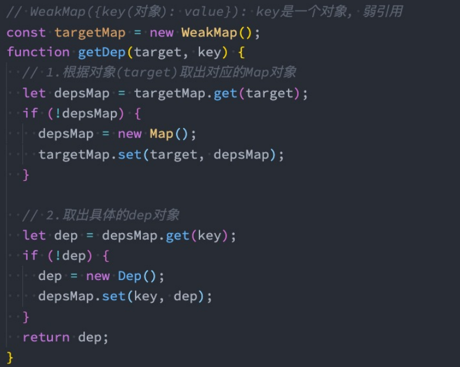

### `ES7↓`

### ArrayInclude

```js
includes(searchElement, startIndex:optional)
```

```js
const arr = ['a']

console.log(arr.includes('a')) // true

console.log(arr.includes('a', 1)) // false
```

和indexOf相比，可以正确判断出包含NaN

```js
const arr = [NaN]

console.log(arr.includes(NaN)) // true

console.log(arr.indexOf(NaN) !== -1) // false
```

### 指数运算

```js
console.log(4 ** 4 === Math.pow(4, 4))
```

`ES8↓`

### ObjectValues

获取所有可枚举的value值组成的数组

```js
const obj = {
  a: 1,
  b: 2
}

console.log(Object.values(obj)) // [ 1, 2 ]
```

### ObjectEntries

获取所有可枚举的key-value键值对组成的数组

```js
const obj = {
  a: 1,
  b: 2
}

console.log(Object.entries(obj)) // [ [ 'a', 1 ], [ 'b', 2 ] ]
```

### StringPadding

字符串填充

长度为总长度，可选的填充符号，默认为空格

```js
const str = 'Hello World'

console.log(str.padStart(15))
console.log(str.padStart(15, '-'))
console.log(str.padEnd(15))
console.log(str.padEnd(15, '-'))

/**
 *     Hello World
 * ----Hello World
 * Hello World
 * Hello World----
 */

const _ID = '310109200006260033'
const last4 = _ID.slice(-4)
console.log(last4.padStart(18, '*'))  // **************0033
```

`ES8↓`

### Object.getOwnPropertyDescriptor

```js
const obj = { a: 1 }

console.log(Object.getOwnPropertyDescriptor(obj, 'a'))
console.log(Object.getOwnPropertyDescriptors(obj))

/**
 *  {value: 1, writable: true, enumerable: true, configurable: true}
 *
 *  {a: {value: 1, writable: true, enumerable: true, configurable: true}}
 */
```

### async await

```js
const foo = async () => {
  await 1
}
```

`ES9↓`

### 对象展开


### Promise finally


### `ES10↓`

### ArrayFlat

```js
const arr = [[[[1]]], 2, 3]

console.log(arr.flat(3))  //[1, 2, 3]
```

### ArrayFlatMap

```js
const strArr = ['Hello World', 'Ni Hao', 'First Blood']

const words = strArr.flatMap(word => word.split(' '))

console.log(words) // [ 'Hello', 'World', 'Ni', 'Hao', 'First', 'Blood' ]
```

### ObjectFromEntries

Object.entries的反向，可用于路由/get参数 传参转回对象


```js
const str = 'name=zwh&age=18&height=171'

// const arr = str.split('&').map(item => item.split('='))

// console.log(Object.fromEntries(arr)) //{ name: 'zwh', age: '18', height: '171' }

const queryParams = new URLSearchParams(str)

console.log(Object.fromEntries(queryParams)) //{ name: 'zwh', age: '18', height: '171' }
```

### trimStart trimEnd

去空格

```js
const str = '  hello   '

console.log(str.trim())
console.log(str.trimEnd())
console.log(str.trimStart())

/**
 * hello
 *   hello
 * hello    
 * 
 */
```

### Symbol


### try catch


### `ES11↓`

### BigInt

数字后面加n即代表大数，bigInt类型直接可以安全准确的计算

```js
const bigInt = BigInt(Number.MAX_SAFE_INTEGER)

console.log(bigInt * 100n)
```

### 空值合并运算符

和||的不同是只有undefined和null会进入默认值，而0和空字符串会保持空字符串

```js
const res1 = '' || 0 || '默认值'
const res2 = '' ?? 0 ?? '默认值'

console.log(res1) //默认值
console.log(res2) //
```

### 可选链

```js
const obj = {}

console.log(obj?.foo?.a) // undefined
```

### GlobalThis

获取全局变量，同时兼容浏览器和Node环境

```js
console.log(globalThis)
```

### 其他

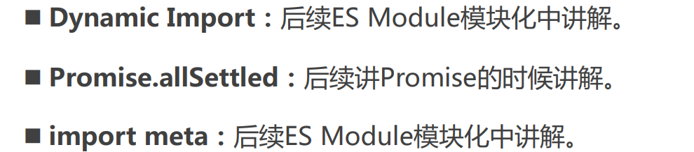

### `ES12↓`

### FinalizationRegistry

可以监听垃圾回收

```js
const final = new FinalizationRegistry(value => {
  console.log(value, '销毁了')
})

let obj = {}

final.register(obj, '备注')

obj = null

// 一定时间后obj被回收输出：备注 销毁了
```

### WeakRefs

略

### logical assignment operators

#### 逻辑或运算符

#### 逻辑与运算符

#### 逻辑空运算符

略，没啥用


### replaceAll

略


## Proxy/Reflect

### 使用Object.defineProperty监听

但是不能监听删除、新增操作（Vue2响应式的缺点）

```js
const obj = {
  age: 18
}

Object.keys(obj).map(key => {
  let newValue = obj[key]
  Object.defineProperty(obj, key, {
    get() {
      console.log('获取')
      return newValue
    },
    set(value) {
      console.log('设置')
      newValue = value
    }
  })
})

console.log(obj.age)
obj.age = 20
console.log(obj.age)

/**
 * 获取
 * 18
 * 设置
 * 获取
 * 20
 */
```

### 使用代理

ES6新增了Proxy，用于帮助创建一个代理


```js
const obj = {
  age: 18
}

const proxy = new Proxy(obj, {
  // 获取的捕获器
  get(target, key) {
    console.log('获取了', key)
    return target[key]
  },
  // 设置的捕获器
  set(target, key, value) {
    console.log('设置了', key)
    target[key] = value
  },
  // 监听in操作符的捕获器
  has(target, key) {
    console.log(`使用了${key}in`)
    return key in target
  },
  // 删除的捕获器
  deleteProperty(target, key) {
    console.log(`删除了${key}`)
    delete target[key]
  }
})

console.log(proxy.age)
proxy.age = 20
console.log(proxy.age)

console.log('age' in proxy)
console.log('name' in proxy)

console.log(obj)

delete proxy.age

console.log(obj)

/**
 * 获取了 age
 * 18
 * 设置了 age
 * 获取了 age
 * 20
 *
 * 使用了agein
 * true
 * 使用了namein
 * false
 * 
 * { age: 20 }
 * 删除了age
 * {}
 */
```

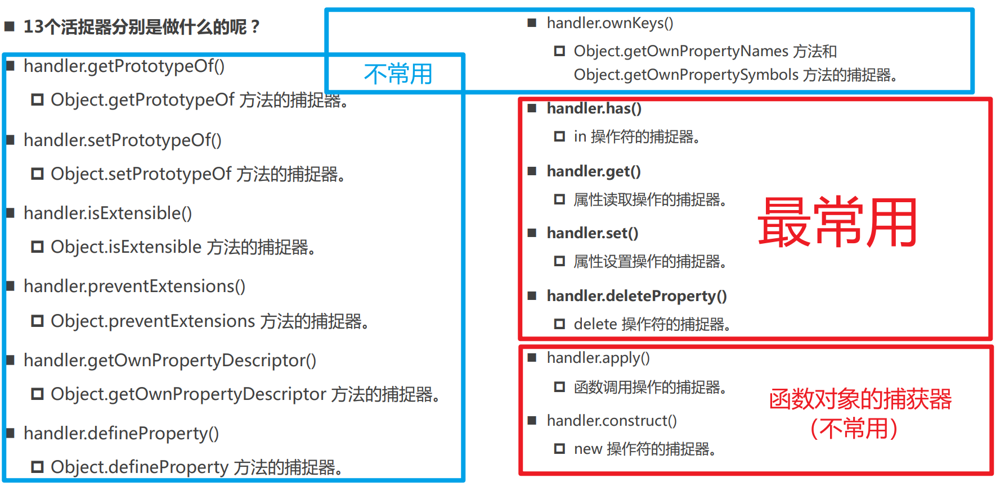

### 使用Reflect

Reflect是ES6新增的API，是一个对象（不是类），反射

Reflect用于替代Object，进行一些操作

[比较 Reflect 和 Object 方法 - JavaScript | MDN (mozilla.org)](https://developer.mozilla.org/zh-CN/docs/Web/JavaScript/Reference/Global_Objects/Reflect/Comparing_Reflect_and_Object_methods)

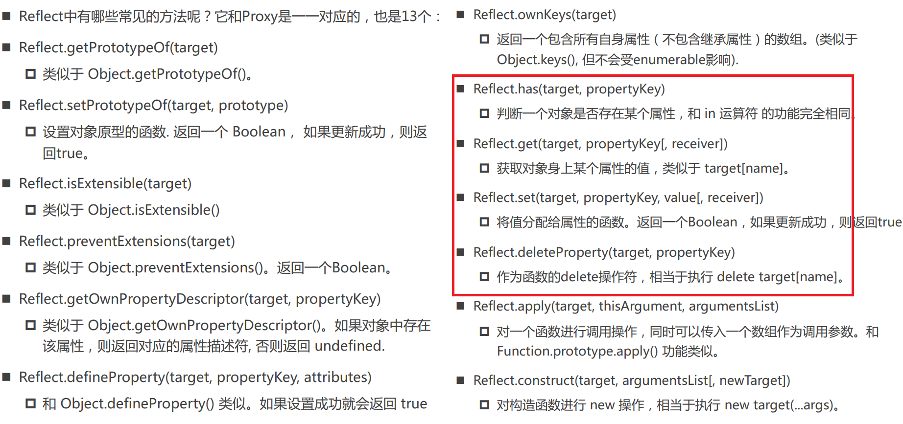

### 结合代理和反射

```js
const proxy = new Proxy(obj, {
  // 获取的捕获器
  get(target, key) {
    console.log('获取了', key)
    return Reflect.get(target, key)
  },
  // 设置的捕获器
  set(target, key, value) {
    console.log('设置了', key)
    Reflect.set(target, key, value)
  },
  // 监听in操作符的捕获器
  has(target, key) {
    console.log(`使用了${key}in`)
    return Reflect.has(target, key)
  },
  // 删除的捕获器
  deleteProperty(target, key) {
    console.log(`删除了${key}`)
    Reflect.deleteProperty(target, key)
  }
})
```

### proxy get、set最后一个参数receiver

receiver可以改变原对象的this

不使用receiver，this会直接访问obj，导致直接访问obj._age

使用receiver，this会指回代理对象proxy，使代理更规范

```js
const obj = {
  _age: 18,
  get age() {
    return this._age
  },
  set age(value) {
    this._age = value
  }
}

const proxy = new Proxy(obj, {
  get(target, key, receiver) {
    console.log(key, '获取') // age 获取  _age 获取
    return Reflect.get(target, key, receiver)
    // return Reflect.get(target, key)
  },
  set(target, key, value, receiver) {
    Reflect.set(target, key, value, receiver)
  }
})

proxy.age
```

### Reflect.construct

相当于new

```js
class Foo {}

const foo = Reflect.construct(Foo, [])

console.log(foo) // Foo {}
```


## Vue2/3 响应式原理

### 思考步骤

1. Depend类，有一个存储响应式变动的函数的集合，有一个新增进集合的函数depend，有一个使用所有函数的方法
2. watchFns函数，把传入的函数赋给全局变量activeFn，并调用一次
3. getDepend函数，以传入的Object为key，找到对应的Map，再以找到的Map为key，找到对应创建的Depend类
4. reactive函数，创建响应式代理，监听到使用变量时，如果是watchFns调用函数时，把这个函数（来自全局变量activeFn）添加进Depend类，如果是后续获取，activeFn是null，不会添加函数。监听到变量变化时，调用一次notify方法，把存储的函数全部调用一遍，完成响应式

### Vue3原理

```js
let activeFn = null

class Depend {
  constructor() {
    this.reactiveFns = new Set()
  }
  depend() {
    if (activeFn) {
      // 判断非空
      this.reactiveFns.add(activeFn)
    }
  }
  notify() {
    this.reactiveFns.forEach(fn => {
      fn()
    })
  }
}

const watchFns = function (fn) {
  activeFn = fn
  fn()
  activeFn = null
}

const targetDepend = new WeakMap()
const getDepend = function (target, key) {
  let objMap = targetDepend.get(target)
  if (!objMap) {
    objMap = new Map()
    targetDepend.set(target, objMap)
  }
  let depend = objMap.get(key)
  if (!depend) {
    depend = new Depend()
    objMap.set(key, depend)
  }
  return depend
}

const reactive = obj =>
  new Proxy(obj, {
    get(target, key, receiver) {
      const depend = getDepend(target, key)
      depend.depend()
      return Reflect.get(target, key, receiver)
    },
    set(target, key, value, receiver) {
      Reflect.set(target, key, value, receiver)
      const depend = getDepend(target, key)
      depend.notify()
    }
  })

const objProxy = reactive({
  name: 'zwh',
  age: 18
})

watchFns(() => console.log(objProxy.age)) // 默认执行两次

watchFns(() => console.log(objProxy.name)) // 默认执行两次

console.log('___________________ObjProxy响应式对象监听变动_____________________')
objProxy.age++
objProxy.age++
objProxy.age++
```

### Vue2原理

```js
const reactive = obj => {
  Object.keys(obj).forEach(key => {
    let value = obj[key]
    Object.defineProperty(obj, key, {
      get() {
        const depend = getDepend(obj, key)
        depend.depend()
        return value
      },
      set(newValue) {
        value = newValue
        const depend = getDepend(obj, key)
        depend.notify()
      }
    })
  })
  return obj
}
```

## Promise

### Promise的状态

分为pending、fulfilled、rejected状态，且状态一旦确定，不可再更改

```js
new Promise((resolve, reject) => {
  // resolve或reject之前是pending（待定）状态
  const num = Math.floor(Math.random() * 10)
  if (num >= 5) {
    resolve(num + '成功') // 处于fulfilled状态（已敲定）
  } else {
    reject(num + '失败') // 处于rejected状态（已拒绝）
  }
})
  .then(res => console.log(res))
  .catch(err => console.log(err))
```

### resolve

resolve除了普通的类型，`还能传递Promise对象`，如果传递了，那么当前Promise的状态会被传递的Promise的状态决定

```js
const foo = new Promise((resolve, reject) => {
  reject('失败') // 处于rejected状态（已拒绝）
})

new Promise((resolve, reject) => {
  resolve(foo) //不会进入fulfilled，而是rejected
})
  .then(res => console.log(res))
  .catch(err => console.log(err)) // 失败
```

也可以传递一个实现了then方法的对象，也会根据then的传递决定当前Promise的状态

```js
new Promise((resolve, reject) => {
  const foo = {
    then(resolve, reject) {
      reject('错误！')  // 因为这里是reject，所以进入了catch
    }
  }
  resolve(foo) //不会进入fulfilled，而是rejected
})
  .then(res => console.log(res))
  .catch(err => console.log(err)) // 错误！
```

### then

#### 返回的Promise可以多次then

```js
const promise = new Promise((resolve, reject) => {
  resolve('hahaha')
})

promise.then(res => console.log(res)) // hahaha

promise.then(res => console.log(res)) // hahaha

promise.then(res => console.log(res)) // hahaha
```

#### then的返回值

1、返回值是普通值（基础类型、引用类型、undefined等）时，可以无限then

没显示返回相当于返回了Undefined

```js
const promise = new Promise((resolve, reject) => {
  resolve()
})

promise
  .then(() => {})
  .then(() => {})
  .then(() => {})
  .then(() => {})
```

2、返回值是Promise对象，那么后续的状态会被传递的Promise的状态决定

```js
const promise = new Promise((resolve, reject) => {
  resolve()
})

promise
  .then(() => new Promise((resolve, reject) => resolve()))
  .then(() => new Promise((resolve, reject) => reject('error')))
  .catch(err => {
    console.log(err)
  })
```

3、返回值是实现了then的对象，也会根据then的传递决定后续的状态

```js
const promise = new Promise((resolve, reject) => {
  resolve()
})

promise
  .then(() => ({
    then(resolve, reject) {
      resolve()
    }
  }))
  .then(() => ({
    then(resolve, reject) {
      reject('error')
    }
  }))
  .catch(err => {
    console.log(err)
  })
```

### catch

对应reject/throw的回调函数

```js
const promise = new Promise((resolve, reject) => {
  // reject('error @@@@')
  throw new Error('error @@@@')
})

promise.catch(err => {
  console.log(err) //Error: error @@@@
})
```

也可以和then拆开写

```js
const promise = new Promise((resolve, reject) => {
  reject('error @@@@')
  // resolve(1)
})

promise.then(res => console.log(res))

promise.catch(err => {
  console.log(err) //Error: error @@@@
})
```

类似于then，也有上述一条的的规则：

1、返回值是普通值（基础类型、引用类型、undefined等）时，可以无限then

2、返回值是Promise对象，那么后续的状态会被传递的Promise的状态决定

3、返回值是实现了then的对象，也会根据then的传递决定后续的状态

### finally

最终执行

### Promise.resolve

同样有直接调用resolve的传入promise、实现then的对象的特殊对待

相当于上面写法的语法糖

```js
// const promise = new Promise((resolve, reject) => {
//   resolve({ a: 1 })
// })

const promise = Promise.resolve({ a: 1 })

promise.then(res => {
  console.log(res) //{ a: 1 }
})
```

### Promise.reject

注意，reject传入promise、实现then的对象，不会像resolve一样

相当于上面写法的语法糖

```js
// const promise = new Promise((resolve, reject) => {
//   reject('err')
// })

const promise = Promise.reject('err')

promise.catch(err => {
  console.log(err) //'err'
})
```

### Promise.all

会等到请求的promise都变成`fulfilled`才进入then

有一个rejected就会立即进入catch 

```js
const p1 = Promise.resolve(1)
const p2 = new Promise(resolve => {
  setTimeout(() => {
    resolve(2)
  }, 3000)
})
const p3 = Promise.resolve(3)

Promise.all([p1, p2, p3])
  .then(([r1, r2, r3]) => {
    console.log(r1) // 1
    console.log(r2) // 2
    console.log(r3) // 3
  })
  .catch(err => {
    console.log(err)
  })
```

### Promise.allSettled

`不希望有reject就结束`

```js
const p1 = Promise.resolve(1)
const p2 = new Promise(resolve => {
  setTimeout(() => {
    resolve(2)
  }, 3000)
})
const p3 = Promise.reject(3)

Promise.allSettled([p1, p2, p3])
  .then(res => {
    console.log(res)
    /**
     * [
     *  { status: 'fulfilled', value: 1 },
     *  { status: 'fulfilled', value: 2 },
     *  { status: 'rejected', reason: 3 }
     * ]
     */
  })
  .catch(err => {
    console.log(err)
  })
```

### Promise.race

返回第一个fulfilled

但是如果第一个就是rejected就会进入catch

```js
const p1 = new Promise((resolve, reject) => {
  setTimeout(() => {
    reject('err')
  }, 1000)
})
const p2 = new Promise(resolve => {
  setTimeout(() => {
    resolve(2)
  }, 2000)
})
const p3 = new Promise(resolve => {
  setTimeout(() => {
    resolve(3)
  }, 3000)
})

Promise.race([p1, p2, p3])
  .then(res => {
    console.log(res) 
  })
  .catch(err => {
    console.log(err) // err
  })
```

### Promise.any

等到至少返回第一个fulfilled

全是拒绝，会全部拒绝后进入catch

```js
const p1 = new Promise((resolve, reject) => {
  setTimeout(() => {
    reject('err')
  }, 1000)
})
const p2 = new Promise(resolve => {
  setTimeout(() => {
    resolve(2)
  }, 2000)
})

Promise.any([p1, p2])
  .then(res => {
    console.log(res) // 2
  })
  .catch(err => {
    console.log(err)
  })
```

## 手写Promise

### 复杂版

```js
const PROMISE_STATUS_PENDING = 'pending'
const PROMISE_STATUS_FULFILLED = 'fulfilled'
const PROMISE_STATUS_REJECTED = 'rejected'

const tryCatch = function (callback, value, resolve, reject) {
  try {
    const res = callback(value)
    resolve(res)
  } catch (error) {
    reject(error)
  }
}

class MyPromise {
  constructor(callback) {
    this.status = PROMISE_STATUS_PENDING
    this.value = undefined
    this.reason = undefined
    this.resolvedCallback = []
    this.rejectedCallback = []

    const resolve = value => {
      if (this.status === PROMISE_STATUS_PENDING) {
        queueMicrotask(() => {
          if (this.status !== PROMISE_STATUS_PENDING) return
          this.status = PROMISE_STATUS_FULFILLED
          this.value = value
          this.resolvedCallback.forEach(fn => {
            fn(this.value)
          })
        })
      }
    }
    const reject = reason => {
      if (this.status === PROMISE_STATUS_PENDING) {
        queueMicrotask(() => {
          if (this.status !== PROMISE_STATUS_PENDING) return
          this.status = PROMISE_STATUS_REJECTED
          this.reason = reason
          this.rejectedCallback.forEach(fn => {
            fn(this.reason)
          })
        })
      }
    }
    callback(resolve, reject)
  }
  then(onFulfilled, onRejected) {
    const defaultOnFulfilled = val => val
    const defaultOnRejected = e => {
      throw e
    }
    onFulfilled = onFulfilled || defaultOnFulfilled
    onRejected = onRejected || defaultOnRejected
    return new MyPromise((resolve, reject) => {
      if (this.status === PROMISE_STATUS_FULFILLED) {
        tryCatch(onFulfilled, this.value, resolve, reject)
      } else if (this.status === PROMISE_STATUS_REJECTED) {
        tryCatch(onRejected, this.reason, resolve, reject)
      } else {
        this.resolvedCallback.push(() => {
          tryCatch(onFulfilled, this.value, resolve, reject)
        })
        this.rejectedCallback.push(() => {
          tryCatch(onRejected, this.reason, resolve, reject)
        })
      }
    })
  }
  catch(onFulfilled) {
    return this.then(undefined, onFulfilled)
  }
  finally(onFinally) {
    return this.then(
      () => {
        onFinally()
      },
      () => {
        onFinally()
      }
    )
  }
  static resolve(value) {
    return new MyPromise(resolve => resolve(value))
  }
  static reject(err) {
    return new MyPromise((resolve, reject) => reject(err))
  }
  static all(args) {
    return new MyPromise((resolve, reject) => {
      const values = []
      args.forEach(p =>
        p
          .then(res => {
            values.push(res)
            if (values.length === args.length) {
              resolve(values)
            }
          })
          .catch(err => reject(err))
      )
    })
  }
  static race(args) {
    return new MyPromise((resolve, reject) => {
      args.forEach(p => p.then(resolve).catch(reject))
    })
  }
}
```

## 迭代器、生成器

Iterator（迭代器）、Generator（生成器）

### 迭代器

迭代器是一个对象，帮助用户依次访问一个另一个对象的元素

- 迭代器协议iterator protocol定义了产生一系列值（无论是有限还是无限个）的标准方式
- 在js中这个标准就是一个特定的next方法

`next`

- 一个无参数或者一个参数的函数，返回一个应当拥有以下两个属性的对象
- done（boolean）
- value

```js
const names = ['zwh', 'lyh', 'xyf']

const iterator = names[Symbol.iterator]()

console.log(iterator.next())
console.log(iterator.next())
console.log(iterator.next())
console.log(iterator.next())

/**
 * {
 *  { value: 'zwh', done: false }
 *  { value: 'lyh', done: false }
 *  { value: 'xyf', done: false }
 *  { value: undefined, done: true }
 * }
 */
```

#### 自制数组迭代器函数

```js
const names = ['zwh', 'lyh', 'xyf']

const iteratorFn = function (arr) {
  let index = 0
  return {
    next() {
      const value = arr[index++]
      if (value) {
        return { done: false, value }
      } else {
        return { done: true, value }
      }
    }
  }
}

const iterator = iteratorFn(names)

console.log(iterator.next())
console.log(iterator.next())
console.log(iterator.next())
console.log(iterator.next())
```

#### 可迭代对象

- 可迭代对象是一个对象
- 符合可迭代协议（iterable protocol），即实现[Symbol iterator]
- 实现了@@iterator方法，可以用[Symbol iterator]访问属性

```js
const iteratorObj = {
  names: ['zwh', 'lyh', 'xyf'],
  [Symbol.iterator]() {
    let index = 0
    return {
      next: () => {
        const value = this.names[index++]
        if (value) {
          return { done: false, value }
        } else {
          return { done: true, value }
        }
      }
    }
  }
}

const iterator = iteratorObj[Symbol.iterator]()

console.log(iterator.next())
console.log(iterator.next())
console.log(iterator.next())
console.log(iterator.next())
```

#### for of是使用迭代器的语法糖

可以对可迭代对象使用for of，对象原本不支持

到done等于true会停止

```js
const iteratorObj = {
  names: ['zwh', 'lyh', 'xyf'],
  [Symbol.iterator]() {
    let index = 0
    return {
      next: () => {
        const value = this.names[index++]
        if (index < 6) {
          return { done: false, value }
        } else {
          return { done: true, value }
        }
      }
    }
  }
}

for (let i of iteratorObj) {
  console.log(i)
}

/**
 * zwh
 * lyh
 * xyf
 * undefined
 * undefined
 */
```

#### 默认可迭代对象

String、Array、Set、Map、Arguments

```js
for (let i of new Map([
  ['key1', 'value1'],
  ['key2', 'value2']
])) {
  console.log(i)  // 注意，Map类型使用迭代器是返回键值对
  // [ 'key1', 'value1' ]
  // [ 'key2', 'value2' ]
}
```

#### 迭代器应用

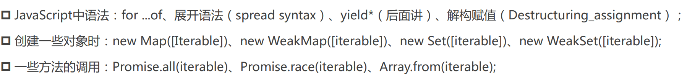

PS：{ ...obj }对象展开和对象的解构，用的不是迭代器，数组才是

#### 自定义类的迭代

```js
class MyClass {
  constructor(name, student) {
    this.name = name
    this.student = student
  }
  [Symbol.iterator]() {
    let index = 0
    return {
      next: () => {
        if (index < this.student.length) {
          return { done: false, value: this.student[index++] }
        } else {
          return { done: true, value: undefined }
        }
      }
    }
  }
}

const c1 = new MyClass('8班', ['zwh', 'lsy', 'yhs', 'das'])

for (const s of c1) {
  console.log(s)
}
```

### 生成器

#### 基础使用

function后面加*，中间用yield停止，返回一个生成器，每次next执行yield之前的代码

next可以传参，用yield接受

yield可以返回值，是next函数的返回值的value


```js
function* foo() {
  console.log(1)
  const a1 = yield 'a'
  console.log(a1)
  const a2 = yield 'b'
  console.log(a2)
  const a3 = yield 'c'
  console.log(a3)
}

const generator = foo()

console.log(generator.next())
console.log(generator.next(2))
console.log(generator.next(3))
console.log(generator.next('end'))

/**
 * 1
 * { value: 'a', done: false }
 * 2
 * { value: 'b', done: false }
 * 3
 * { value: 'c', done: false }
 * end
 * { value: undefined, done: true }
 */

```

#### return

使用return，done会变为true，之后用next都无用了

也可以直接调用return，代码也会立即中断，下面的代码也不会执行了

```js
function* foo() {
  console.log(1)
  yield 'a'
  console.log(1)
  yield 'b'
  console.log(2)
  yield 'c'
  console.log(3)
}

const generator = foo()

console.log(generator.next())
console.log(generator.return(2))
console.log(generator.next())
console.log(generator.next())

/**
 * 1
 * { value: 'a', done: false }
 * { value: 2, done: true }
 * { value: undefined, done: true }
 * { value: undefined, done: true }
 */
```

### 生成器替代迭代器

#### 简易示例

```js
const arr = ['a', 'b', 'c']

function* iteratorFn(arr) {
  // 1、直接yield
  // yield 'a'
  // yield 'b'
  // yield 'c'
  // 2、for of
  // for(const i of arr) {
  //   yield i
  // }
  // 3、yield*
  yield* arr
}

const iterator = iteratorFn(arr)

console.log(iterator.next())
console.log(iterator.next())
console.log(iterator.next())
console.log(iterator.next())
```

```js
function* iteratorRangeFn(start, end) {
  let index = start
  while (index < end) {
    yield index++
  }
}

const iterator = iteratorRangeFn(10, 12)

console.log(iterator.next()) // { value: 10, done: false }
console.log(iterator.next()) // { value: 11, done: false }
console.log(iterator.next()) // { value: undefined, done: true }
```

```js
class MyClass {
  constructor(student) {
    this.student = student
  }
  *[Symbol.iterator]() {
    yield* this.student
  }
}

const c1 = new MyClass(['zwh', 'lsy', 'yhs', 'das'])

for (const s of c1) {
  console.log(s)
}

/**
 * zwh
 * lsy
 * yhs
 * das
 */
```

### 异步函数的处理（await的原理）

foo函数的处理过程

1. 执行exec函数
2. 获取第一个yield的返回值，是done-value的键值对
3. 如果done为true，终止迭代。如果done为false，value是一个Promise，获取期约返回值，递归
4. 第二次exec，会传入第一次的期约返回值使res2=zwhaaa，然后依次执行

即`await async`的原理是生成器

```js
const requestData = function (res) {
  return new Promise(resolve => {
    setTimeout(() => {
      resolve(res)
    }, 500)
  })
}

function* getData() {
  const res1 = yield requestData('zwh')
  const res2 = yield requestData(res1 + 'aaa')
  const res3 = yield requestData(res2 + 'bbb')
  const res4 = yield requestData(res3 + 'ccc')
  console.log(res4);
}

function foo(genFn) {
  const generator = genFn()
  function exec(res) {
    const result = generator.next(res)
    if (result.done) {
      return
    }
    result.value.then(res => {
      exec(res)
    })
  }
  exec()
}

foo(getData)  // zwhaaabbbccc
```

```js
const requestData = function (res) {
  return new Promise(resolve => {
    setTimeout(() => {
      resolve(res)
    }, 500)
  })
}

async function getData() {
  const res1 = await requestData('zwh')
  const res2 = await requestData(res1 + 'aaa')
  const res3 = await requestData(res2 + 'bbb')
  const res4 = await requestData(res3 + 'ccc')
  console.log(res4)
}

getData()  // zwhaaabbbccc
```

## Async Await

### 特点

async函数返回值一定是一个Promise(相当于一个Promise.then的返回值，也支持thenable的接口)

```js
async function foo() {
  return 1
}
console.log(foo()) // Promise { 1 }
```

async中抛出的异常会作为返回值Promise的reject

```js
async function foo() {
  throw 'err'
}

foo().catch(err => console.log(err))

console.log('后续代码') 
// 后续代码
// err
```

await会阻塞代码，包括非期约

```js
async function foo() {
  await 1
  console.log(2)
}

foo()

console.log(1)

// 1
// 2
```

## 进程和线程

### 概念

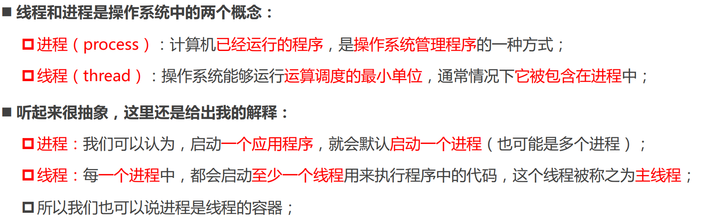

### 事件队列

- JS代码实际上在一个单独的线程运行
- 因此网络请求、定时器、Promise.then是在事件队列中

### 浏览器的事件循环

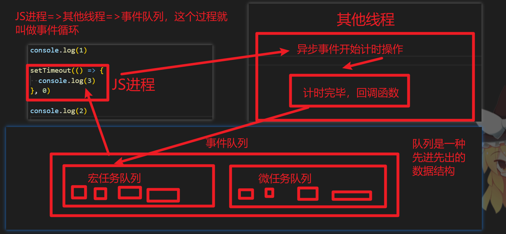

### 宏任务

`执行任何宏任务之前，微任务队列必须先清空`

定时器、Ajax请求、Dom回调

### 微任务

`执行任何宏任务之前，微任务队列必须先清空`

queueMicrotask、Promise.then

### 宏任务微任务

`执行任何宏任务之前，微任务队列必须先清空`

```js
setTimeout(() => {
  console.log(2)
}, 0)

Promise.resolve(1).then(res => {
  console.log(res)
})

// 1 => 2
```


## 防抖和节流

### 防抖

限制事件的频繁发生

#### 应用

- 点击按钮
- 输入联想
- 浏览器滚动和缩放

#### 手写防抖（1、简易方案）

```js
const debounce = function (fn, delay) {
  let timer = null
  const _debounce = function (...args) {
    if (timer) {
      clearTimeout(timer)
    }
    timer = setTimeout(() => {
      fn.apply(this, args)
    }, delay)
  }
  return _debounce
}
```

#### 手写防抖（2、复杂方案）

可以立即执行一次

```js
const debounce = function (fn, delay, immediate = false) {
  let timer = null
  let isDo = false
  const _debounce = function (...args) {
    if (immediate && !isDo) {
      fn.apply(this, args)
      isDo = true
    }
    if (timer) {
      clearTimeout(timer)
    }
    timer = setTimeout(() => {
      fn.apply(this, args)
      isDo = false
    }, delay)
  }
  return _debounce
}
```

### 节流

控制事件发生的频率

#### 应用

- 游戏的技能，按得再快也有内置cd，转完才能继续放

#### 手写节流（1、定时器方案）

第一次事件时不会立即触发

```js
const throttle = function (fn, delay) {
  let timer = null
  const _throttle = function (...args) {
    if (!timer) {
      timer = setTimeout(() => {
        fn.apply(this, args)
        timer = null
      }, delay)
    }
  }
  return _throttle
}

window.addEventListener(
  'scroll',
  throttle(() => {
    console.log(1, this)
  }, 1000)
)
```

#### 手写节流（时间戳方案）

第一次事件时会立即触发

```js
const throttle = function (fn, interval) {
  let lastTime = 0
  const _throttle = function (...args) {
    const nowTime = new Date().getTime()
    const remainTime = interval - (nowTime - lastTime)
    if (remainTime <= 0) {
      fn.apply(this, ...args)
      lastTime = nowTime
    }
  }
  return _throttle
}
```

## 深拷贝

```js
const isObject = function (value) {
  const type = typeof value
  return value !== null && (type === 'function' || type === 'object')
}

const deepClone = function (value) {
  if (typeof value === 'function') {
    return value
  }
  if (!isObject(value)) {
    return value
  }
  const newObj = Array.isArray(value) ? [] : {}
  for (const k in value) {
    newObj[k] = deepClone(value[k])
  }
  return newObj
}
```

## 事件总线

```js
class EventBus {
  constructor() {
    this.eventBus = {}
  }
  on(eventName, eventCallback, thisArg) {
    let handlers = this.eventBus[eventName]
    if (!handlers) {
      handlers = []
      this.eventBus[eventName] = handlers
    }
    handlers.push({
      eventCallback,
      thisArg
    })
  }
  emit(eventName, ...payload) {
    const handlers = this.eventBus[eventName]
    if (!handlers) return
    handlers.forEach(handler => {
      handler.eventCallback.apply(handler.thisArg, payload)
    })
  }
  off(eventName, eventCallback) {
    const handlers = this.eventBus[eventName]
    if (!handlers) return
    const newHandlers = [...handlers]
    for (let i = 0; i < newHandlers.length; i++) {
      const handler = newHandlers[i]
      if (eventCallback === handler.eventCallback) {
        const index = handlers.indexOf(handler)
        handlers.splice(index, 1)
      }
    }
  }
}

const eventBus = new EventBus()

const log = content => console.log(content + '@')

eventBus.on('test', log)

eventBus.emit('test', 'hello world')

eventBus.off('test', log)

eventBus.emit('test', 'hello world')
```

