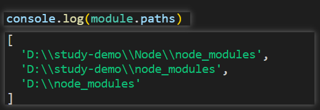
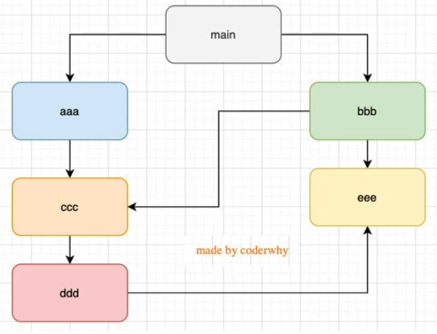
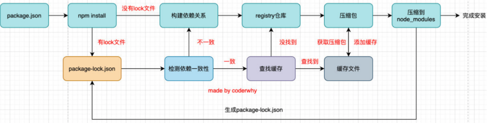
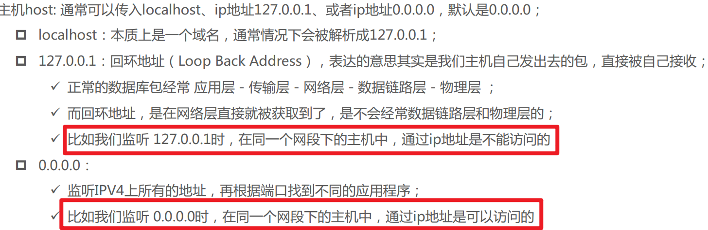
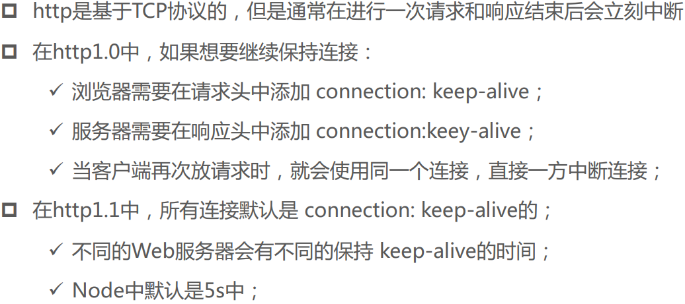
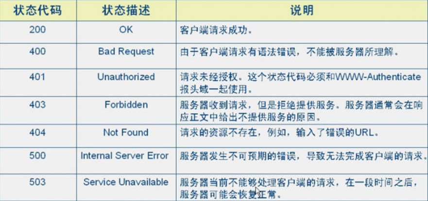
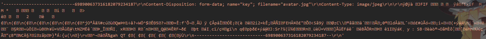
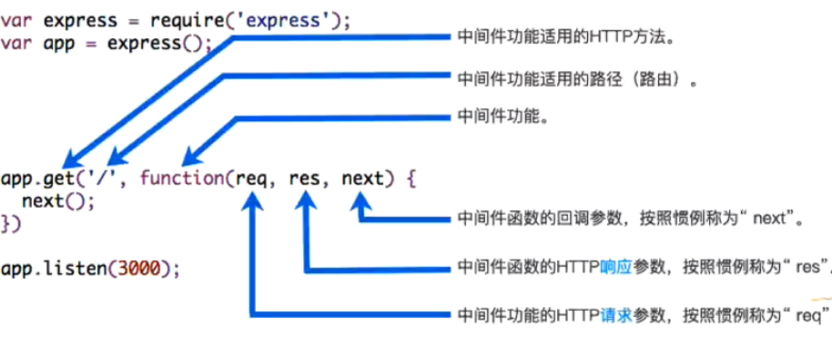
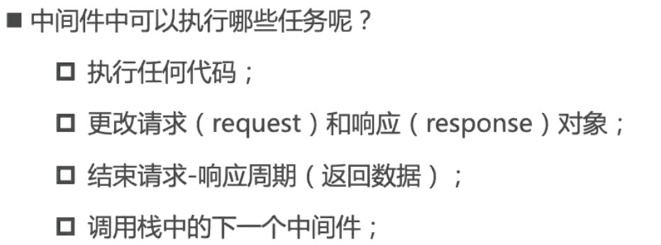

## 基础

### node.js是什么

Node.js 是一个 基于V8引擎的JavaScript运行环境


## node传参

在node运行命令后添加参数，在全局对象process数组第三项开始可以依次获取参数

```bash
node index.js a b c
```

```js
process.argv.forEach((arg, index) => {
  console.log(`第${index + 1}个参数是：${arg}`)
})

/**
 *  第1个参数是F:\nodejs\node.exe
 *  第2个参数是D:\study-demo\Node\index.js
 *  第3个参数是a
 *  第4个参数是b
 *  第5个参数是c
 */
```

## 常见的全局对象

### console

[Console | Node.js v14.20.1 Documentation (nodejs.org)](https://nodejs.org/docs/latest-v14.x/api/console.html)

```js
# 打印
console.log([conetnt])

# 清空控制台
console.clear()

# 打印函数的调用栈
console.trace()
```

### 特殊的全局对象

命令行中不可使用，实质上是模块的变量，但每个模块都有

#### dirname和filename

```js
#打印当前文件夹的绝对路径
console.log(__dirname)

#打印当前文件的绝对路径
console.log(__filename)
```

#### 其他

`exports`、`module`、`require()`

### process对象

提供了Node进程相关的信息，如Node的运行环境，参数信息等

### 定时器函数

```js
#延时执行一次
setTimeout(callback, delay[, ...args])

#重复执行
setInterval(callback, delay[, ...args])

#立即执行
setImmediate(callback[, ...args])

#添加到下一次tick队列
process.nextTick(callback[,...args])
```

### gloabal

相当于浏览器的window

但是var声明的变量也不会挂载到global上


## Javascript 模块化

### 不使用模块

使用闭包返回一个"模块"，可以在别的JS文件调用

```js
// 模块A
var moduleA = (function () {
  var age = 18
  return {
    age
  }
})()
```

```js
// 使用模块A的代码
console.log(moduleA.age) // 18
```

### commonJs规范

#### 核心变量

exports、module.exports、require

#### 本质

node中commonjs的本质就是对象的引用赋值

#### 使用exports

实际上exports是一个空对象，然后require执行了引用赋值exports这个对象的操作，因此也可以进行解构操作

因为地址相同，在使用的文件，也可以反向修改声明的文件

```js
const sayHi = function (name) {
  console.log(name)
}

exports.sayHi = sayHi
```

```js
const A = require('./test')

A.sayHi('zwh')
```

#### 使用module.exports

默认下node最开始会执行 exports = module.exports

而require会取module.exports

因此，如果让module.exports等于一个新对象，exports的导出会失效，转而使用新对象的内容

```js
exports.a = 'old'

module.exports = {
  a: 'new'
}
```

```js
const A = require('./test')

console.log(A.a) // new
```

#### require细节

require是一个函数，用于引入文件/模块导出的`对象`

##### 查找规则

require(X)

1. requireX是核心模块（http、fs等）

   直接返回核心模块，并停止查找

2. X是以./或../或/开头的

   会将X当做文件在对应目录进行查找

   有后缀名，按后缀名查找

   没有后缀名依次以直接查找文件X、X.js、X.json、X.node

   还没找到会将X作为一个目录，一次查找下方的index.js、index.json、index.node

   还没找到会报错

3. requireX不是核心模块

   从本目录开始，依次往上查找node_modules文件夹

   

##### require是同步的

会等模块加载完成再执行下方的代码

执行下方的index.js ，依次打印test和index

```js
// test.js
console.log('test')
```

```js
// index.js
require('./test')

console.log('index')
```

##### require初次引入，内部的JS代码会被运行依次

同上

##### 模块被多次引用时，会缓存，只运行一次

模块存在module.loaded的布尔属性，运行完成后会变为true

如果为true就会缓存，不会运行了

##### require的循环引入



Node使用了数据结构的图结构的深度优先搜索

该图为main->aaa->ccc->ddd->eee， eee不再require文件便原路返回main,再main->bbb

#### commonJs的缺点

因为是同步的，只有模块加载完毕才能运行当前模块的内容

直接用于浏览器，必须等下载完JS代码才能进行后续操作

而webpack会对commonJs进行转换

### ES Module

使用了import和export关键字，不是对象

采用ES Module将自动开启严格模式

#### 常规使用

注意，export { f2 }不是对象，而是一个引用列表，因此不能f2: f2，但可以用as声明别名

```js
export const f1 = 'f1'

const f2 = 'f2'

export { f2 }

const f3 = 'f3'

export { f3 as myF3 }
```

没有webpack必须加.js后缀名，此处的大括号同样不是对象

```js
// 1、普通导入
import { f1, f2, myF3 } from './test.js'
console.log(f1) // f1
console.log(f2) // f2
console.log(myF3) // f3

// 2、别名导入
import { f1, f2, myF3 as f3 } from './test.js'
console.log(f1) // f1
console.log(f2) // f2
console.log(f3) // f3

// 3、全部导入
import * as Test from './test.js'
console.log(Test.f1) // f1
console.log(Test.f2) // f2
console.log(Test.myF3) // f3
```

#### 同时export和import

一般用于将暴露的接口放到同一个文件中，方便阅读

```js
// import { a } from './test.js'

// export { a }

// 相当于

export { a } from './test.js'
```

#### default用法

导出无需指定名字

导入时无需{}，可以自己制定任意名字

但一个模块只能默认导出一个

```js
export default function () {
  console.log('foo')
}

import bar from './test.js'

bar() // foo
```

#### ES Module不能放在条件判断内

```js
// if (true) {
//   import bar from './test.js' // 导入声明只能在模块的顶层使用

//   bar()
// }
```

替代写法

1. 改用require
2. 改用import()函数，返回的是一个promise

```js
if (true) {
  // import bar from './test.js' // 导入声明只能在模块的顶层使用

  // const { bar } = require('./test')

  import('./test.js').then(res => {
    res.foo()
  })

  bar()
}
```

#### 其他

- ES Module加载JS文件是编译时加载的，是`异步`的，加载模块不会阻塞后续代码执行
- ES Module导出一个变量时，会创建一个`实时`的`模块环境记录`
  1. 因此，如果导出的模块的变量发生了变化，导入的地方也能获取到最新的变量
  2. 但导入的地方不能修改变量，是一个常量
  3. 如果导出的是一个对象，可以正常修改对象的属性（因为对象的地址没改变）

```js
export let count = 0

setTimeout(() => {
  count++
}, 1000)
```

```js
import { count } from './test.js'

console.log(count) // 0

setTimeout(() => {
  console.log(count) // 1
}, 2000)
```

#### node中使用ES Module

PS：要较新的的版本才能使用ES Module

直接在node中使用ES Module会报错：Cannot use import statement outside a module

有两种解决方式

1. 修改packjson.json

   添加"type": "module"， 默认是commonjs

2. 修改js文件后缀名

   将引入和导出的JS文件，后缀名该为mjs


### ES Module和CommonJs交互

1. 一般来说CommonJs不能加载ES Module的导出
2. 大多数情况，ES Module可以加载CommonJs的导出


## 常见的内置模块

### path

用于对路径和文件进行处理

#### resolve

可以帮助处理多操作系统下不同的路径问题

join方法类似效果，但比较笨

```js
const path = require('path')

const basePath = './demo/test/'

const filename = '1.txt'

const filePath = path.resolve(basePath, filename)

console.log(filePath) // D:\学习笔记\Node\demo\test\1.txt
```

#### 获取文件信息

```js
const path = require('path')

const filePath = './demo/test/1.txt'

console.log(path.dirname(filePath)) //./demo/test
console.log(path.basename(filePath)) //1.txt
console.log(path.extname(filePath)) //.txt
```

### fs

fs的函数一般有三种方式

1. Promise
2. 回调
3. 同步

#### stat

例子：使用stat如下的Promise版本，可以获取文件的信息（大小、创建时间等）

```js
import { stat } from 'fs/promises'

try {
  const res = await stat('./test.txt')
  console.log(res)
} catch (error) {
  console.error('there was an error:', error.message)
}
```

#### 文件描述符

例子，先用open回调版本获取文件描述符，再用fstat获取信息，f开头代表需要一个文件描述符fd

```js
import { open, fstat } from 'fs'

open('./test.txt', (err, fd) => {
  if (err) {
    console.log(err)
    return
  }
  // 通过文件描述符fd获取文件的信息
  fstat(fd, (err, info) => {
    if (err) {
      console.log(err)
      return
    }
    console.log(info)
  })
})
```

#### 文件读写

[File system | Node.js v14.20.1 Documentation (nodejs.org)](https://nodejs.org/docs/latest-v14.x/api/fs.html#fs_fs_writefile_file_data_options_callback)

```js
import fs from 'fs'

fs.writeFile(
  './test.txt',
  'hello world\n\n',
  {
    flag: 'a'
  },
  () => {
    console.log('成功写入了')
  }
)
```

```js
import { readFile } from 'fs/promises'

try {
  const res = await readFile('./test.txt', { encoding: 'utf8' })
  console.log(res)
} catch (err) {
  console.error(err)
}
```

#### 文件夹操作

获取对应文件夹下全部文件的名字

```js
import fs from 'fs/promises'
import path from 'path'

const basePath = './img'

const getFileName = async basePath => {
  try {
    const files = await fs.readdir(basePath, { withFileTypes: true })
    for (const file of files) {
      if (file.isFile()) {
        console.log(file.name)
      } else {
        getFileName(path.resolve(basePath, file.name))
      }
    }
  } catch (err) {
    console.error(err)
  }
}

getFileName(basePath)
```

#### 文件重命名

```js
import fs from 'fs/promises'

const basePath = './test.txt'

fs.rename(basePath, './test2.txt')
```

### events

事件发射、接受、取消

```js
import { EventEmitter } from 'events'

const emitter = new EventEmitter()

const log = arg => console.log(arg)

emitter.on('foo', log)

emitter.emit('foo', 'zwh')

emitter.emit('bar', 'zwh')

emitter.off('foo', log)

emitter.emit('foo', 'zwh')
```


## 包管理工具Npm

### 官网

[npm (npmjs.com)](https://www.npmjs.com/)

### package.json

- `name`： 项目的名称[必填]

- `version`：版本号[必填]

  版本号规范：X.Y.Z

  1. X做了不兼容的API修改
  2. Y做了向下兼容的功能性新增
  3. Z做了向下兼容的问题修正
  4. `^x.y.z`，代表X永远不变，Y和Z安装最新
  5. `~x.y.z`，代表X和Y永远不变，Z安装最新

- description：描述信息

- author：作者

- license：开源协议

- private：是否私有，true时不可发布

- main：入口 一般模块才有用，webpack会自动找入口

- `scripts`：用于配置一些脚本命令

- `dependencies`:开发和生产都要用的包

  npm install --production 可以只安装生产包

- `devDependencies`：开发用的包

- engines: 指定node和npm的版本号

- browserslist：配置浏览器兼容情况，为webpack服务

### npm install原理



### 其他npm命令

- npm uninstall [package]
- npm rebuild：强制重新rebuild
- npm cache clean：清除缓存

### cnpm

```bash
npm i -g cnpm --registry=https://registry.npmmirror.com/
```

### npx

- npx运行时会到


## 开发脚手架工具

### 脚手架原理

帮你去拉取对应的模板，并执行一些操作

### 配置环境变量

```bash
# 获取npm本地前缀
npm config get prefix

# 设置npm本地前缀，这里存放了全部npm全局安装的库（如nodemon、vue等）
npm config set prefix "C:\Users\DELL\AppData\Roaming\npm"

# 设置环境变量,在我的电脑属性的高级系统设置
NODE_PATH = C:\Users\DELL\AppData\Roaming\npm
```

### 基础Demo

```js
#!/usr/bin/env node

console.log(1)
```

```json
{
  "name": "learn_node",
  "version": "1.0.0",
  "description": "",
  "main": "index.js",
  "bin": {
    "demo": "index.js"
  },
}
```

使用命令npm link，会自动绑定命令，然后输入demo，会打印1

### 用例

```js
#!/usr/bin/env node

const { program } = require('commander')

/* -V: 获取版本号 */
program.version(require('./package.json').version)

/* 添加自己的option，前面是命令，后面是help显示的描述 */
/* 添加对应的argument，前面是参数名，后面是描述和未填写时的默认值 */
program
  .option('-l --login', 'login test')
  .argument('<username>', 'user to login')
  .argument('[password]', 'password for user, if required', '123456')
  .action((username, password) => {
    if (username === 'zwh' && password === '123456') {
      console.log('Login Success')
    } else {
      console.log('Login Fail')
    }
  })

program.parse()
```

```bash
demo -l zwh
String: 'Login Success'
demo -l zwh 111
String: 'Login Fail'
demo -l zhangsan
String: 'Login Fail'
```

### 脚手架发布

```bash
npm login

npm publish
```

## Buffer

### 简介

用于处理二进制相关

Buffer会以16进制显示，从最小00到最大ff

```js
const msg = '你好'

const buffer = Buffer.from(msg)

console.log(buffer) // <Buffer e4 bd a0 e5 a5 bd>

console.log(buffer.toString()) // '你好'
```

### 分配大小和指定内容

也可以

```js
const buffer = Buffer.alloc(3)

buffer[0] = 0xe4
buffer[1] = 0xbd
buffer[2] = 0xa0

console.log(buffer) // <Buffer e4 bd a0>

console.log(buffer.toString()) // 你
```

###  buffer和文件转化

```js
import { readFile } from 'fs/promises'

try {
  const res = await readFile('./test.txt')
  console.log(res) // <Buffer 68 65 6c 6c 6f 20 77 6f 72 6c 64>
  console.log(res.toString()) // hello world
} catch (err) {
  console.error(err)
}
```

### 使用sharp

安装sharp的注意事项：修改镜像源

[Installation - sharp - High performance Node.js image processing (pixelplumbing.com)](https://sharp.pixelplumbing.com/install#chinese-mirror)

```js
const sharp = require('sharp')
const fs = require('fs')

fs.readFile('./avatar.jpg', (err, data) => {
  if (err) {
    console.log(err)
    return
  }
  sharp(data)
    .rotate(90)
    .resize(200)
    .toFile('output.jpg', err => err)
})
```


## 浏览器的事件循环

### 概念


### 事件队列

- JS代码实际上在一个单独的线程运行
- 因此网络请求、定时器、Promise.then是在事件队列中

### 浏览器的事件循环


### 宏任务

`执行任何宏任务之前，微任务队列必须先清空`

定时器、Ajax请求、Dom回调

### 微任务

`执行任何宏任务之前，微任务队列必须先清空`

queueMicrotask、Promise.then

### 宏任务微任务

`执行任何宏任务之前，微任务队列必须先清空`

```js
setTimeout(() => {
  console.log(2)
}, 0)

Promise.resolve(1).then(res => {
  console.log(res)
})

// 1 => 2
```


## Node的事件循环和异步IO

### 概念

Node的事件循环根据LIBUV库进行实现，LIBUV维护了一个EVENT LOOP和一个WORKER THREAD（线程池）


### 阻塞IO和非阻塞IO

- 阻塞式调用：结果返回前，当前线程会处于阻塞，得到调用结果后才会继续执行
- 非阻塞式调用：调用后当前线程不会停止执行，只要过一段时间检查一下有没有结果返回即可

而LIBUV帮助我们确认非阻塞调用的结果是否完成，这个确认的过程就叫做`事件轮询`

#### 阻塞和异步的区别


### 微任务执行顺序

1. ticks队列最先执行
2. 其他微任务按先后依次执行

### 宏任务执行顺序

1. timers: 执行`setTimeout`和`setInterval`的回调
2. pending callbacks: 执行延迟到下一个循环迭代的 I/O 回调
3. poll: 检索新的 I/O 事件;执行与 I/O 相关的回调。事实上除了其他几个阶段处理的事情，其他几乎所有的异步都在这个阶段处理。
4. check: `setImmediate`在这里执行
5. close callbacks: 一些关闭的回调函数，如：`socket.on('close', ...)`

### tips

- `poll的执行`

  之后未必会执行check阶段，如果有定时器到期会会到timers阶段

- `setImmediate和setTimeout的先后问题`

  setTimeout塞入timers，setImmediate塞入check

  node中`setTimeout其实默认1毫秒`，

  event loop中timers阶段，如果过了1ms，执行setTimeout的回调，如果没过进入check阶段执行setImmediate的回调

- `process.nextTick`

  不属于Event loop的任`何时间段，它会立即执行，然后再继续event loop


## stream

### 概念

是一种可读、可写的字节流

### 应用

相比文件读写，可以进行一些细节控制

- 可以控制从哪个位置开始读，读到哪里，一次读多少字节
- 到哪个位置暂停，某个时刻继续
- 视频文件分段读取

### 实例

#### 读取

```js
const fs = require('fs')

const reader = fs.createReadStream('./1.txt', {
  start: 3, // 开始字节
  end: 10, // 结束字节
  highWaterMark: 3 // 一次最多多少字节
})

reader.on('data', data => {
  console.log(data)
  reader.pause()
  setTimeout(() => {
    reader.resume()
  }, 1000)
})

reader.on('end', () => {
  console.log('读取结束')
})
```

#### 写入

```js
const fs = require('fs')

const writer = fs.createWriteStream('./1.txt', {
  flags: 'a+'
})

let num = 0

const fn = () => {
  writer.write(`${num++}\n`, err => {
    if (err) {
      console.log(err)
      return
    }
    if (num === 10) {
      writer.end() // writer.close()
      return
    }
    console.log(`写入${num}`)
    setTimeout(() => {
      fn()
    }, 500)
  })
}

fn()

writer.on('close', () => {
  console.log('close')
})
```

#### 管道

```js
const fs = require('fs')

const reader = fs.createReadStream('./1.txt')
const writer = fs.createWriteStream('./2.txt')

reader.pipe(writer)
```


## Http模块

### 概念

http模块用于开发`web服务器`

客户端通过http请求资源，提供资源的服务器就是Web服务器

### 创建服务器

```js
const http = require('http')

const port = 8000

const server = http.createServer((req, res) => {
  // 相当于const server = new http.Server((req, res) => {
  res.end('Hello World')
  // 相当于 res.write('Hello World)
  // 再 res.end()
})

server.listen(port, '0.0.0.0', () => {
  console.log(`启动在: 0.0.0.0:${port}`)
})
```

### listen的参数

- 参数一：port

  启动的端口号，不写会自动分配一个未使用端口号

- 参数二：host

  

  不写，ipv4分配0.0.0.0， ivp6分配::

- 参数三：启动成功的回调函数

### request对象

request对象包含了客户端给服务器传递的所有信息

```js
const server = http.createServer((req, res) => {
  console.log(req.url)
  console.log(req.method)
  console.log(req.headers)
  res.end('Hello World')
})
```

### GET请求：url和qs库的使用

url用于解析get请求的复杂url，可以拆分成pathname和query

qs用于拆分query为对象

```js
const http = require('http')
const url = require('url')
const qs = require('querystring')

const port = 8000

const server = http.createServer((req, res) => {
  const { pathname, query } = url.parse(req.url)
  const { name, age } = qs.parse(query)
  console.log(pathname)
  console.log('name:', name, 'age:', age)
  res.end(`name: ${name}, age: ${age}`)
})

server.listen(port, '0.0.0.0', () => {
  console.log(`启动在: 0.0.0.0:${port}`)
})
```

### POST请求：body的处理和JSON的使用

```js
const http = require('http')
const url = require('url')

const port = 8000

const server = http.createServer((req, res) => {
  const { pathname } = url.parse(req.url)
  console.log(pathname)
  if (pathname === '/api/user') {
    if (req.method === 'POST') {
      req.setEncoding('utf-8')
      req.on('data', data => {
        const { name, age } = JSON.parse(data)
        console.log('name:', name, 'age:', age)
        res.end(`name: ${name}, age: ${age}`)
      })
    }
  }
})

server.listen(port, '0.0.0.0', () => {
  console.log(`启动在: 0.0.0.0:${port}`)
})
```

### headers对象

- content-type：这次请求携带的数据的类型

  - application/json表示是一个json类型；
  - text/plain表示是文本类型；
  - multipart/form-data表示是上传文件 等

- content-length：文件的大小和长度

- keep-alive

  

- accept-encoding：告知服务器，客户端支持的文件压缩格式，比如js文件可以使用gzip编码，对应 .gz文件

- accept：告知服务器，客户端可接受文件的格式类型

- user-agent：客户端相关的信息

### 状态码的设置



```js
const server = http.createServer((req, res) => {
  res.statusCode = 400
  // res.writeHead(200)
  res.end('返回')
})
```

### 响应header的设置

- res.setHeader：一次可以写入一个头部信息
- res.writeHead：同时写入header和status

进入浏览器，可以渲染出红色h2标签

```js
const server = http.createServer((req, res) => {
  res.writeHead(200, {
    'Content-type': 'text/html;charset=utf8'
  })
  // res.setHeader('Content-type', 'text/html;charset=utf8')
  res.end('<h2 style="color: red">Hello World</h2>')
})
```

### 原生Node发送请求

#### get

```js
const http = require('http')

http.get('http://localhost:8000', res => {
  res.on('data', res => {
    console.log(res.toString())
  })
})
```

#### post

不能http.post的方式来调用，同时必须request.end()结束请求才能成功发送

```js
const http = require('http')

const request = http.request(
  {
    method: 'POST',
    hostname: 'localhost',
    port: 8000
  },
  res => {
    res.on('data', res => {
      console.log(res.toString())
    })
  }
)

request.end()
```

### 错误文件上传

直接把全部data写入了文件，混有部分请求信息，是错误的上传方式

```js
const http = require('http')
const { createWriteStream } = require('fs')

const port = 8000

const server = http.createServer((req, res) => {
  const writer = createWriteStream('./demo.jpg')
  req.on('data', data => {
    writer.write(data)
  })
  req.on('end', () => {
    res.end('End')
  })
})

server.listen(port, '0.0.0.0', () => {
  console.log(`启动在: 0.0.0.0:${port}`)
})
```

### 正确文件上传

上传一个图片文件完整的body体（二进制编码下）

需要去除头尾的多余信息



```js
const http = require('http')
const qs = require('querystring')
const fs = require('fs')

const port = 8000

const server = http.createServer((req, res) => {
  if (req.url === '/upload') {
    if (req.method === 'POST') {
      // 必须设置，使用二级制处理文件
      req.setEncoding('binary')
      let body = ''
      // 获取boundary
      const boundary = req.headers['content-type'].split(';')[1].split('=')[1]
      req.on('data', data => {
        body += data
      })
      req.on('end', () => {
        // 1.获取image/png的位置
        const payload = qs.parse(body, '\r\n', ': ')
        const type = payload['Content-Type']

        // 2.开始在image/png的位置进行截取
        const typeIndex = body.indexOf(type)
        const typeLength = type.length
        let imageData = body.substring(typeIndex + typeLength)

        // 3.将中间的两个空格去掉
        imageData = imageData.replace(/^\s\s*/, '')

        // 4.将最后的boundary去掉
        imageData = imageData.substring(0, imageData.indexOf(`--${boundary}--`))

        fs.writeFile('./foo.png', imageData, 'binary', err => {
          res.end('文件上传成功~')
        })
      })
    }
  }
})

server.listen(port, '0.0.0.0', () => {
  console.log(`启动在: 0.0.0.0:${port}`)
})
```


## Express框架

### 基础

express的核心就是中间件（回调函数）

```js
#使用脚手架
npx express-generator

#直接安装
npm i express
```

### 自己搭建

导入的express是一个函数，用法类似原生HTTP服务器

```js
const express = require('express')

const app = express()

const port = 8000

// 监听GET请求
app.get('/home', (req, res) => {
  res.writeHead(200, {
    'Content-type': 'text/html;charset=utf8'
  })
  res.end('<h2 style="color: red;">GET请求</h2>')
})

// 监听POST请求
app.post('/user', (req, res) => {
  res.end('POST请求')
})

app.listen(port, () => {
  console.log('启动成功')
})
```

### 中间件



- 中间件函数是传递给中间件的一个回调函数
- 回调函数有三个参数
  - request请求对象
  - response响应对象
  - next函数（express定义的用于执行下一个中间件的函数）



#### 使用中间件

- app.use
- app.method[get、post、all等]

注意：

- `使用next就可以进入下一个匹配的中间件`，且res.end不会影响下一个中间件的执行
- 但是res.end()之后不能再写入，即不能再res.write(写入内容)或res.end(写入内容)

```js
const express = require('express')

const app = express()

const port = 8000

app.use((req, res, next) => {
  console.log('中间件1')
  next()
})

// 监听POST请求
app.post('/user', (req, res, next) => {
  res.end('POST请求')
  next()
})

app.use((req, res, next) => {
  console.log('中间件2')
  next()
})

app.listen(port, () => {
  console.log('启动成功')
})
```

中间件也可以有多个中间件函数

```js
app.post(
  '/user',
  (req, res, next) => {
    console.log('post请求1')
    next()
  },
  (req, res, next) => {
    console.log('post请求2')
    res.end('end')
  }
)
```

### express.json内置中间件

```js
const express = require('express')

const app = express()

const port = 8000

app.use(express.json())

app.use(express.urlencoded({ extended: true }))

// 监听POST请求
app.post('/user', (req, res, next) => {
  console.log(req.body)
  res.end('end')
})

app.listen(port, () => {
  console.log('启动成功')
})
```

express.json()实际上实现了一个内置的中间件，差不多相当于的实现的复杂版

app.use(express.urlencoded({ extended: true }))类似， extended: true是代表使用了外部库qs，false为使用node内置库queryString

```js
app.use((req, res, next) => {
  if (req.headers['content-type'] === 'application/json') {
    req.on('data', data => {
      req.body = JSON.parse(data.toString())
    })
    req.on('end', () => {
      next()
    })
  } else {
    next()
  }
})
```

### multer中间件

用于解析form-data 表单提交

```js
const express = require('express')
const multer = require('multer')

const app = express()

const port = 8000

const uploader = multer()

app.use(uploader.any())

app.post('/test', (req, res, next) => {
  console.log(req.body)
  res.end('end')
})

app.listen(port, () => {
  console.log('启动成功')
})
```

#### multer上传文件

tips:

1. storage.destination 如果传入的是一个函数，传入的文件夹路径必须实现存在，也可以传入字符串
2. 除了upload.any，还有upload.single、upload.array、upload.fields、upload.none等
3. 不应该把any、single等注册为全局中间件，可能会被恶意用户上传文件到路由

```js
const express = require('express')
const path = require('path')
const multer = require('multer')

const app = express()

const port = 8000

const storage = multer.diskStorage({
  destination: (req, file, callback) => {
    callback(null, './upload')
  },
  filename: (req, file, callback) => {
    callback(null, Date.now() + path.extname(file.originalname))
  }
})

const upload = multer({
  storage
})

// 使用upload any中间件或者upload single中间件
// app.use(upload.any())
// app.use(upload.single('file')) // 只上传一个文件

// 监听文件上传请求
app.post('/upload', upload.any(), (req, res, next) => {
  console.log(req.files) // any, 获取文件信息
  // console.log(req.file) // single, 获取文件信息
  res.end('end')
})

app.listen(port, () => {
  console.log('启动成功')
})
```

### morgan中间件

用于生成日志

```js
const fs = require('fs')

const express = require('express')
const morgan = require('morgan')

const app = express()

app.use(express.json())

const port = 8000

const writableStream = fs.createWriteStream('./logs/access.log', {
  flags: 'a+'
})

app.use(morgan('combined', { stream: writableStream }))

app.post('/user', (req, res, next) => {
  console.log(req.body)
  res.end('end')
})

app.post('/login', (req, res, next) => {
  console.log(req.body)
  res.end('end')
})

app.listen(port, () => {
  console.log('启动成功')
})
```

### get请求的query和param

```js
// /user/12312312132
app.get('/user/:id', (req, res, next) => {
  console.log(req.params) // { id: 12312312132 }
  res.end('end')
})

// /user?name=zwh&age=18
app.get('/user', (req, res, next) => {
  console.log(req.query) // { name: zwh, age: 18 }
  res.end('end')
})
```

### response响应数据

```js
app.get('/user', (req, res, next) => {
  res.status(200)
  res.json({ a: 1 })
})
```


### Express路由

每个路由相当于一个个新的小express实例

```js
const express = require('express')

const router = express.Router()

router.get('/', (req, res, next) => {
  res.json(['zwh', 'lj', 'xyf'])
})

router.get('/:id', (req, res, next) => {
  res.json('zwh')
})

router.post('/', (req, res, next) => {
  res.json('添加成功')
})

module.exports = router
```

```js
const userRouter = require('./router/user')

app.use('/user', userRouter)
```

```js
get /user => ['zwh', 'lj', 'xyf']
get /user/123 => 'zwh'
post /user => '添加成功'
```


### 静态资源服务器

访问localhost:8000/dist,即可进入dist打包的网站

```js
const express = require('express')

const app = express()

const port = 8000

app.use('/dist', express.static('./dist'))

app.listen(port, () => {
  console.log('启动成功')
})
```


### 错误处理的优雅方式

`next携带参数，会进入有四个参数的错误处理中间件`

```js
const express = require('express')

const router = express.Router()

const LOGIN_ERROR = 'LOGIN_ERROR'

router.post('/login', (req, res, next) => {
  const flag = Math.random() > 0.5
  if (flag) {
    res.json({
      code: 200,
      msg: '成功'
    })
  } else {
    next(new Error(LOGIN_ERROR))
  }
})

router.use((err, req, res, next) => {
  let msg = ''
  let status = 400
  switch (err.message) {
    case LOGIN_ERROR:
      msg = '用户登录失败'
      break
    default:
      msg = 'NOT FOUND'
      break
  }
  res.json({
    errCode: status,
    errMsg: msg
  })
})

module.exports = router
```

### express核心源码解读

12：2:15:18


## Koa框架

### 基础

- koa不是类似express的一个函数，而是一个类
- 同样使用app.use创建一个新的中间件
- 同样使用app.listen监听一个port
- ctx.body可以返回，返回字符串、数组、对象等均可

```js
const koa = require('koa')

const app = new koa()

app.use(async (ctx, next) => {
  ctx.body = {
    code: 200,
    msg: 'hello world'
  }
})

app.listen(8000)
```

### koa路由

- koa没有提供method的方式来注册中间件，只能使用use方法
- koa也不能在use中加路径
- koa也不能在一个app内连续注册中间件

因此koa使用中间件需要自己手动判断路径和方法，比较麻烦，因此使用koa路由来简化代码

用法很近似于express，koa路由不是koa官方提供的库，是社区实现的

```js
const userRouter = require('./router/user')

app.use(userRouter.routes())
app.use(userRouter.allowedMethods())
```

```js
const Router = require('koa-router')

const router = new Router({ prefix: '/user' })

router.get('/', (ctx, next) => {
  ctx.body = {
    code: 200,
    msg: ''
  }
})

router.post('/', (ctx, next) => {
  ctx.body = {
    code: 200,
    msg: 'Login Success'
  }
})

module.exports = router
```

### koa路由解析query和params

params是/:id 的id部分

query是?name=zwh&age=18的 name和age部分

```js
{{local}}/user/12312312?name=zwh&age=18
```

```js
const router = new Router({ prefix: '/user' })

router.get('/:id', (ctx, next) => {
  console.log({ ...ctx.request.params })
  console.log({ ...ctx.request.query })
  ctx.body = 'end'
})

//{ id: '12312312' }
//{ name: 'zwh', age: '18' }
```

### koa解析json、urlencoded、form-data等

#### koa-bodyparser

安装三方库koa-bodyparser，即可解析application/json格式和application/x-www-form-urlencoded格式

```js
const bodyParser = require('koa-bodyparser')

const app = new koa()

app.use(bodyParser())
```

```js
router.post('/', (ctx, next) => {
  console.log(ctx.request.body)
  ctx.body = 'end'
})

// { "name": "zwh" }
```

##### @koa/multer文件上传

https://github.com/koajs/multer

用法和express的multer一样

```js
const path = require('path')

const Router = require('koa-router')
const multer = require('@koa/multer')

const router = new Router({ prefix: '/upload' })

const storage = multer.diskStorage({
  destination: (req, file, callback) => {
    callback(null, './upload')
  },
  filename: (req, file, callback) => {
    callback(null, Date.now() + path.extname(file.originalname))
  }
})

const upload = multer({ storage }) // note you can pass `multer` options here

// add a route for uploading single files
router.post('/single', upload.single('avatar'), ctx => {
  ctx.body = 'done'
})

module.exports = router
```

### koa数据的响应

使用ctx.body = '响应数据' 即可

可以设置的值如下

- string：字符串数据
- Buffer：Buffer数据
- Stream：流数据
- Object || Array： 对象或数组
- null：不输出任何内容

如果ctx.status未主动设置，koa会自动设置为200

如果返回body为null，会自动设置为204

```js
ctx.status = 200
ctx.body = '成功'
```

### koa 静态资源服务器

```bash
npm i koa-static
```

```js
const koaStatic = require('koa-static')

app.use(koaStatic('./img'))
```

### koa源码阅读

13：01：47：32


## Koa对比Express

### 需求分析

- 中间件1中在req.message添加一个字符串aaa
- 中间件2中在req.message添加一个字符串bbb
- 中间件3中在req.message添加一个字符串ccc
- 全部添加结束后，在`middleware1`中返回结果

### 同步情况下

express和koa是一样的，请求后均返回aaabbbccc

m1 next执行后到m2，m2 next执行后到m3， m3 执行后执行m1的res.json

```js
const m1 = (req, res, next) => {
  req.msg = 'aaa'
  next()
  res.json({
    status: 200,
    msg: req.msg
  })
}
const m2 = (req, res, next) => {
  req.msg += 'bbb'
  next()
}
const m3 = (req, res, next) => {
  req.msg += 'ccc'
}

app.use(m1)
app.use(m2)
app.use(m3)
```

### 异步情况下

#### express

返回aaabbb，ccc因为是异步操作，不能加上的时候，m1已经结束

```js
const m1 = (req, res, next) => {
  req.msg = 'aaa'
  next()
  res.json({
    status: 200,
    msg: req.msg
  })
}
const m2 = (req, res, next) => {
  req.msg += 'bbb'
  next()
}
const m3 = async (req, res, next) => {
  const p1 = new Promise(resolve => {
    setTimeout(() => {
      req.msg += 'ccc'
      resolve()
    }, 3000)
  })
  await p1
}
```

#### koa

`koa的next函数是一个Promise，可以处理express难以处理的异步操作`

如下代码三秒后可以正常返回aaabbbccc

```js
const m1 = async (ctx, next) => {
  ctx.request.msg = 'aaa'
  await next()
  ctx.body = {
    status: 200,
    msg: ctx.request.msg
  }
}
const m2 = async (ctx, next) => {
  ctx.request.msg += 'bbb'
  await next()
}
const m3 = async (ctx, next) => {
  const p1 = new Promise(resolve => {
    setTimeout(() => {
      ctx.request.msg += 'ccc'
      resolve()
    }, 3000)
  })
  await p1
}
```

## Koa的洋葱模型

是中间件处理代码的过程


## MySql

### 数据库

#### 关系型数据库

如：MySql、Sql Server、Oracle等

会创建很多表，表之间互相关联，使用Sql语句

#### 非关系型数据库

如：MongoDB、Redis

可以直接存储一个Json，无需Sql性能更高

#### 选择

一般后端开发使用关系型数据库，存储爬虫的数据使用MongoDB


