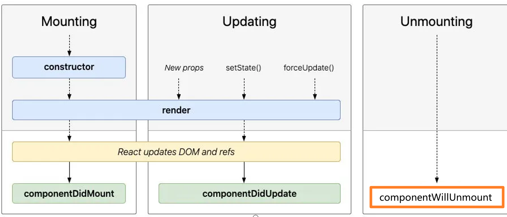

## React基础

### 三个依赖包

使用react分别依赖react核心库，react dom库，转换jsx需要的babel库

同时，引入的js文件(script标签)，必须加上type=text/babel 属性

```html
<script crossorigin src="https://unpkg.com/react@18/umd/react.development.js"></script>
<script crossorigin src="https://unpkg.com/react-dom@18/umd/react-dom.development.js"></script>
<script src="https://unpkg.com/babel-standalone@6/babel.min.js"></script>
```

### render函数渲染元素（新旧两种方式）

- 新版本为先创建根元素，再用render函数渲染组件
- 旧版本为直接使用render函数，传入要渲染的组件和根元素选择器

`react18版本`

```jsx
const root = ReactDOM.createRoot(document.querySelector('#root'))

root.render(<h2>Hello World</h2>)
```

`React18之前的版本`

```jsx
ReactDOM.render(<h2>Hello World</h2>, document.querySelector('#root'))
```

### 更新内容

React中更新内容需要手动调用render函数，即更新变量后，需要手动调用，而非Vue中的自动更新

1. 声明一个rootRender函数
2. 调用rootRender函数
3. 点击回调中，更新变量后再调用一次rootRender函数

```jsx
const root = ReactDOM.createRoot(document.querySelector('#root'))

let msg = 'Hello World'

const btnClick = () => {
  msg = 'Hello React'

  render()
}

const render = () => {
  root.render(
    <div>
      <h2>{msg}</h2>
      <button onClick={btnClick}>btnClick</button>
    </div>
  )
}

render()
```

### 类组件

自定义类组件

1. 类组件的名字，必须用大驼峰，不然react会识别为html元素
2. 类组件，需要继承自React.Component类，也需要调用super
3. 类组件的变量定义在constructor的this.state中
4. 类组件必须有一个render函数

其他`重要`

1. 因为使用了ES6的class，因此默认内部开启了严格模式，btnClick这种自定义方法，内部回调时相当于显式绑定this，this的指向为undefined，需要在调用的时候用bind改变this的指向，也可以在constructor提前修改函数的指向
2. this.setState函数，继承自React.Component类，内部做了修改变量和调用render函数两件事情

```jsx
class App extends React.Component {
  constructor() {
    super()

    this.state = {
      msg: 'hello world'
    }

    // this.btnClick = this.btnClick.bind(this)
  }

  btnClick() {
    this.setState({
      msg: 'hello React'
    })
  }

  render() {
    return (
      <div>
        <h2>{this.state.msg}</h2>
        <button onClick={this.btnClick.bind(this)}>btnClick</button>
      </div>
    )
  }
}
```

### 实例1：列表渲染

```jsx
class List extends React.Component {
  constructor() {
    super()

    this.state = {
      data: ['a', 'b', 'c', 'd', 'e']
    }
  }

  render() {
    return (
      <ul>
        {this.state.data.map(item => (
          <li key={item}>{item}</li>
        ))}
      </ul>
    )
  }
}
```

### 实例2：计数器

```jsx
class Counter extends React.Component {
  constructor() {
    super()

    this.state = {
      count: 0
    }
  }

  increment() {
    this.setState({
      count: this.state.count + 1
    })
  }

  decrement() {
    this.setState({
      count: this.state.count - 1
    })
  }

  render() {
    const { count } = this.state

    return (
      <div>
        <h2>计数器：{count}</h2>
        <button onClick={this.increment.bind(this)}>increment</button>
        <button onClick={this.decrement.bind(this)}>decrement</button>
      </div>
    )
  }
}
```

## JSX

### 原因

为什么React使用JSX，因为React认为html和js的关系是紧密耦合的，ui中需要事件绑定，展示数据，某些状态改变时又需要改变状态，因此React将html和js结合在一个文件里，即实现了html in js，即jsx

### 插入的内容

#### 插入变量

- Number、String、Array可以直接显示

- Undefined、Null、Boolean不会显示
- Object不能显示，报错

```jsx
render() {
  const number = 1,
    string = 'hello',
    array = ['a', 'b', 'c']

  const aaa = undefined,
    bbb = null,
    ccc = true

  const obj = { name: 'zwh' }

  return (
    <div>
      <ul>
        <li>{number}</li>
        <li>{string}</li>
        <li>{array}</li>
        <li>{aaa}</li>
        <li>{bbb}</li>
        <li>{ccc}</li>
        {/* <li>{obj}</li> */}
      </ul>
    </div>
  )
}
```

#### 插入表达式

- 可以插入运算式
- 可以插入三元运算符
- 可以执行某个函数

### 属性绑定

#### 基本属性绑定

```jsx
render() {
  const url = 'www.baidu.com'
  
  return (
    <a href={url}>百度一下</a>
  )
}
```

#### class绑定

- 不是动态绑定

```jsx
<h2 className="a b c">hello world</h2>
```

- 动态绑定，第一种，模板字符串

```jsx
const classNames = `a b ${true ? 'c' : ''}`

return <h2 className={classNames}>hello world</h2>
```

- 动态绑定，第二种，数组

```jsx
const classNames = ['a', 'b']
if(true) classNames.push('c')

return <h2 className={classNames.join(' ')}>hello world</h2>
```

- 动态绑定，第三种，classNames库

[JedWatson/classnames: A simple javascript utility for conditionally joining classNames together (github.com)](https://github.com/JedWatson/classnames)

#### style绑定

需要两个大括号，第一个代表react绑定属性，第二个是对象字面量

```jsx
<h2 style={{color: 'red'}}>hello world</h2>
```

### 事件绑定

因为jsx语法实际内部是调用了React.createElement函数，直接绑定this.function，函数最后会相当于直接显式绑定直接调用了，又因为位置在class内部，自动开启了严格模式，因此this的指向是undefined，因此需要改变默认的this指向

事件绑定存在三种改变this指向的方法

1. 使用bind显式改变this的指向（掌握）
2. 利用箭头函数，继承父级作用域的this指向（了解）
3. 利用箭头函数，进行隐式this绑定（最常用）
   - 使用箭头函数，参数的传递很方便（同时传递event和普通的参数）

```jsx
class Counter extends React.Component {
  constructor() {
    super()

    this.state = {
      count: 0
    }
  }

  increment() {
    this.setState({
      count: this.state.count + 1
    })
  }

  increment2 = () => {
    this.setState({
      count: this.state.count + 1
    })
  }

  render() {
    return (
      <div>
        <h2>{this.state.count}</h2>
        <button onClick={this.increment.bind(this)}>increase1</button>
        <button onClick={this.increment2}>increase2</button>
        <button onClick={event => this.increment(event)}>increase3（最常用）</button>
      </div>
    )
  }
}
```

### 条件渲染

一般使用如下三种

1. if、else进行判断
2. 三目运算符
3. &&
   - 一般用于请求服务器数据前，值可能为null或undefined的情况

#### 条件判断实例

```jsx
class Condition extends React.Component {
  constructor() {
    super()

    this.state = {
      isShow: false
    }
  }

  toggleShow() {
    this.setState({
      isShow: !this.state.isShow
    })
  }

  render() {
    const { isShow } = this.state

    return (
      <div>
        <button onClick={() => this.toggleShow()}>toggleShow</button>
        {/* 模拟v-if */}
        {isShow && <h2>模拟v-if</h2>}
        {/* 模拟v-show */}
        <h2 style={{display: isShow ? 'block' : 'none'}}>模拟v-show</h2>
      </div>
    )
  }
}
```

### `JSX的本质`

jsx经过babel转换，会转换成原生React的React.createElement函数

这个函数有三个参数

1. 第一个参数：元素的类型
2. 第二个参数：元素的属性，类型是对象，如果没有属性为null
3. 第三个参数：元素的子元素，如果是字符串直接字符串即可，如果还有嵌套的元素，继续嵌套一层React.createElement函数即可

```jsx
<div>
  <h2 className="title">Hello World</h2>
</div>

/* 经过babel转换，相当于 */
React.createElement('div', null, 
  React.createElement('h2', {class: 'title'}, 'Hello World')
)
```

## React组件化

### 类组件规范

1. 组件名必须是大写开头
2. 必须继承React.Component 类
3. 必须实现render函数

### 函数组件特点

1. this不指向组件实例，即不使用this
2. 不能保存自己的state
3. 没有生命周期

使用React hooks可以改善第二和第三的缺点

### 生命周期



React的主要生命周期有三个

1. componentDidMount
2. componentDidUpdate
3. componentWillUnmount

分别对应

1. 挂载完成
2. 更新完成
3. 卸载前

创建如下组件时，会依次

```jsx
import React from 'react'

class HelloWorld extends React.Component {
  constructor() {
    super()

    this.state = {
      message: 'Hello World'
    }

    console.log('constructor')
  }

  render() {
    console.log('render')

    const { message } = this.state

    return (
      <>
        <p>{message}</p>
        <button onClick={() => this.changeMsg()}>changeMsg</button>
      </>
    )
  }

  changeMsg() {
    this.setState({
      message: '你好，世界'
    })
  }

  componentDidMount() {
    console.log('componentDidMount')
  }

  componentDidUpdate() {
    console.log('componentDidUpdate')
  }

  componentWillUnmount() {
    console.log('componentWillUnmount')
  }
}

export default HelloWorld
```

#### `生命周期执行顺序`

1. 组件初始化时，会依次执行constructor函数、render函数，再执行生命周期componentDidMount
2. 组件更新时，会依次执行render函数，再执行生命周期componentDidUpdate
3. 组件销毁前，会执行生命周期函数componentWillUnmount
4. 同时初始化多个组件，会依次执行每个组件的constructor，再执行render，呈现constructor=>render=>constructor=>render=>constructor=>render的趋势，全部完毕后再执行全部的componentDidMount生命周期函数


#### 生命周期操作

`componentDidMount`

1. 进行dom操作
2. 发送网络请求
3. 进行一些订阅操作

`componentDidUpdate`

1. 获取更新之后的Dom
2. 对更新前后的props比较，发送网络请求

`componentDidMount`

1. 执行清理操作

#### 其他不常用的生命周期

[React.Component – React (reactjs.org)](https://zh-hans.reactjs.org/docs/react-component.html#rarely-used-lifecycle-methods)


### 组件通信

1. 父组件可以传递属性给子组件
2. 子组件可以在constructor函数接受props参数
3. 子组件可以在super传递props参数，把props属性挂载到组件实例上
4. render函数内，如果挂载了props属性，可以获取到props
5. 类组件默认执行可constructor函数，如果不需要管理state，可以省略constructor函数

```jsx
import React from 'react'

class HelloWorld extends React.Component {
  // constructor(props) {
  //   super(props)
  // }

  render() {
    const { list } = this.props

    return (
      <ul>
        {list.map(item => (
          <li key={item}>{item}</li>
        ))}
      </ul>
    )
  }
}

export default HelloWorld
```

### 组件参数默认值

使用静态属性，或者给实例添加属性即可

可以配合typescript，或者react自带的propTypes

```jsx
import React from 'react'

const defaultProps = {
  list: ['a', 'b', 'c']
}

class HelloWorld extends React.Component {
  static defaultProps = defaultProps

  render() {
	// ...
  }
}

// HelloWorld.defaultProps = defaultProps

export default HelloWorld
```

### 组件子传父

父组件给子组件传递一个函数，子组件通过回调函数操作数据

```jsx
// 父组件
import React, { Component } from 'react'
import CounterItem from './CounterItem'

export class Counter extends Component {
  constructor() {
    super()

    this.state = {
      counter: 0
    }
  }

  render() {
    const { counter } = this.state

    return (
      <>
        <h2>{counter}</h2>
        <CounterItem increment={count => this.increment(count)} />
      </>
    )
  }

  increment(count) {
    this.setState({
      counter: this.state.counter + count
    })
  }
}

export default Counter
```

```jsx
// 子组件
import React, { Component } from 'react'

export class CounterItem extends Component {
  render() {
    const { increment } = this.props

    return (
      <>
        <button onClick={() => increment(1)}>+1</button>
        <button onClick={() => increment(5)}>+5</button>
        <button onClick={() => increment(10)}>+10</button>
      </>
    )
  }
}

export default CounterItem
```

### 组件实现插槽（children）

父组件传递元素，子组件通过props的children属性接受

1. `如果只传递了一个元素，children就是这个元素本身`
2. `如果传递了多个元素，children是传递的多个元素组成的数组`
3. 可以通过propTypes约束children必须传递单个还是多个

```jsx
<Navbar>
  <button>+1</button>
  <h2>Hello World</h2>
  <i>Love</i>
</Navbar>
```

```jsx
export class Navbar extends Component {
  render() {
    const { children } = this.props

    return (
      <div className="navbar">
        <div className="left">{children[0]}</div>
        <div className="middle">{children[1]}</div>
        <div className="right">{children[2]}</div>
      </div>
    )
  }
}
```

### 组件实现插槽（props）(推荐)

直接通过props实现插槽

```jsx
<Navbar2 leftSlot={<button>+1</button>} middleSlot={<h2>Hello World</h2>} rightSlot={<i>Love2</i>} />
```

```jsx
export class Navbar extends Component {
  render() {
    const { leftSlot, middleSlot, rightSlot } = this.props

    return (
      <div className="navbar">
        <div className="left">{leftSlot}</div>
        <div className="middle">{middleSlot}</div>
        <div className="right">{rightSlot}</div>
      </div>
    )
  }
}
```

### 组件实现作用域插槽

利用回调函数

父组件传入一个回调函数，子组件可以把自己的数据传入这个回调函数，父组件可以获取到数据进行操作

```jsx
// 父组件
render() {
  const { content, currentIndex } = this.state

  return (
    <>
      <NavItem
        list={['流行', '新款', '精选']}
        currentIndex={currentIndex}
        itemClick={(...args) => this.itemClick(...args)}
        slotScope={item => this.getNavItem(item)}
      />
      <h1 className="content">{content}</h1>
    </>
  )
}

getNavItem(item) {
  if (item === '流行') {
    return <span>{item}</span>
  } else if (item === '新款') {
    return <button>{item}</button>
  } else {
    return <i>{item}</i>
  }
}
```

```jsx
// 子组件
render() {
  const { itemClick, list, currentIndex, slotScope } = this.props

  return (
    <nav>
      <ul>
        {list.map((item, index) => (
          <li className={currentIndex === index ? 'active' : ''} key={item} onClick={() => itemClick(item, index)}>
            {slotScope(item)}
            {/* <span>{item}</span> */}
          </li>
        ))}
      </ul>
    </nav>
  )
}
```

### 属性传值展开

如果已经有了一个 props 对象，你可以使用展开运算符 `...` 来在 JSX 中传递整个 props 对象。以下两个组件是等价的

可以通过这种方式多层传递this.props达成跨层级组件传值

```jsx
function App1() {
  return <Greeting firstName="Ben" lastName="Hector" />;
}

function App2() {
  const props = {firstName: 'Ben', lastName: 'Hector'};
  return <Greeting {...props} />;
}
```

### Context上下文

Context用于跨过中间元素传递props，即不同层级访问一些相同的数据

Context传递数据，子元素需要写在Provider里面

```js
// context/info-content

import React from 'react'

// 传递的参数，是如果没有provider时的默认值
const InfoContext = React.createContext({
  name: 'zwh',
  age: 18
})

export default InfoContext
```

```jsx
<InfoContext.Provider
  value={{
    name: 'zwh',
    age: 18
  }}
>
  <HelloWorld />
</InfoContext.Provider>
```

```jsx
class HelloWorld extends React.Component {
  static contextType = InfoContext

  render() {
	console.log(this.context)  // {name: 'zwh', age: 18}
  }
}
```

#### 函数组件使用context

类组件其实也能这样写

1. 在context.consumer标签内部
2. 传入一个回调函数，回调函数的参数是共享的context
3. 这个函数返回一个jsx

```jsx
import InfoContext from '../context/info-context'

const HelloWorld = () => {
  return (
    <InfoContext.Consumer>
      {value => (
        <>
          <h2>{value.name}</h2>
          <h2>{value.age}</h2>
        </>
      )}
    </InfoContext.Consumer>
  )
}

export default HelloWorld
```

## setState

### React为什么要用setState

1. 因为state更新后，希望React根据最新的state重新渲染页面，但React不能监听的数据变化
2. React没有实现Vue的Object.defineProperty或Proxy的数据劫持
3. 需要手动调用setState告诉React数据发生了变化

### setState的三种用法

`基础用法`

1. setState相当于调用了Object.assign(this.state, newState)，合并了新旧的两个对象

```jsx
// this.state = {count: 0, msg: 'Hello'}

this.setState({
  count: 100
})
```

`回调用法`

比起基础用法的好处

1. 可以从参数获取之前的state和props
2. 可以在回调函数里面进行一些耦合的操作，不用拆分出去

```jsx
this.setState((state, props) => {
  // 进行部分逻辑操作
  return {
  	count: 100  
  }
})
```

`立即获取最新的state`

基础用法，或回调用法，第二个参数也可以传入一个回调函数，可以在内部获取最新的state

```jsx
this.setState(
  {
    counter: this.state.counter + count
  },
  () => {
    console.log('最新的state：', this.state)
  }
)
console.log('不能及时获取：', this.state)
```

### setData为什么要设计成异步

1. setData设计成异步可以提高性能
   - 如果setData是同步的，那么在连续调用多次setData时（如批量请求接口），会多次执行render函数，重复渲染Dom，浪费性能
   - React的设计是合并多次setData，然后批量更新，只调用一次render函数
2. 如果设计成同步，render函数执行延迟，会造成父组件的state和子组件的props不同步
   - 不同步会造成调试时数据混乱

### 旧版本同步的setData

- React18之前，Promise、setTimeout、原生事件处理（addEventListener），内部的setData，是同步的
- React18，全部setData是异步的

### 使setData变为同步

使用react-dom包的flushSync

```jsx
console.log('old:', this.state.counter) // 0
flushSync(() => {
  this.setState({ counter: this.state.counter + 1 })
})
console.log('new:', this.state.counter) // 1
```

### setData修改规范

`纯组件内`，不能直接修改state后再调用setState，因为在调用shouldComponentUpdate时，前后两次的state是相同的，永远不会调用render函数

正确应该对那个state属性进行一次浅拷贝（利用解构即可），对新解构出的新属性修改，再setState到state内

```jsx
// 错误示例
btnClick() {
  this.state.data.push({ name: 'nie', age: 50 })

  this.setState({
    data: this.state.data
  })
}
```

```jsx
// 正确示例
btnClick() {
  const data = [...this.state.data]

  data.push({ name: 'nie', age: 50 })

  this.setState({
    data
  })
}
```

## React性能优化

### diff算法

1. 同层节点比较，不会跨层级比较
2. 同类型的节点才比较，类型改变，这个树会整个重新渲染
3. 可以通过指定key提高性能
   - key必须唯一
   - 指定index为key只能消除警告，不能提高性能

### shouldComponentUpdate

默认情况下，如果App组件调用了setState，App和App下面的所有组件都会调用render函数，性能较差

- React默认情况下，调用setStata就会调用render函数
- 可以通过生命周期shouldComponentUpdate，返回一个false阻止render函数的调用提高性能
- shouldComponentUpdate接收两个参数，分别是nextProps，nextState，和当前的props和state进行比对，如果发生了修改，返回一个true调用render函数

### 纯组件pureComponent

纯组件是shouldComponentUpdate的替代

使用纯组件，react内部会调用shouldComponentUpdate，若当前组件的state未发生改变，或当前的props未发生改变时，会阻止render函数的调用，提高性能

#### 类组件

类组件改为继承React.pureComponent即可

```jsx
export class Home extends PureComponent {
  render() {
    const { count } = this.props

    console.log('home_class render')

    return (
      <>
        <h2>类组件，使用PureComponent：{count}</h2>
      </>
    )
  }
}
```

#### 函数组件

函数组件改为使用memo函数包裹，导出返回值即可

```jsx
import React, { memo } from 'react'

const Home = memo(({ count }) => {
  console.log('Home_Function render')

  return (
    <>
      <h2>函数组件，使用memo：{count}</h2>
    </>
  )
})

export default Home
```

## Ref获取Dom

### 三种方式

使用ref属性

1. 用废弃的this.refs获取
2. （推荐）用createRef api
3. ref属性传递一个回调函数，第一个参数即dom元素

```jsx
import React, { createRef, PureComponent } from 'react'

export class App extends PureComponent {
  constructor() {
    super()

    this.h2Ref2 = createRef()

    this.h2Ele = null
  }

  render() {
    return (
      <>
        <h2 ref="aaaaa">11111</h2>
        <h2 ref={this.h2Ref2}>11111</h2>
        <h2 ref={el => (this.h2Ele = el)}>11111</h2>
        <button onClick={() => this.btnClick()}>btnClick</button>
      </>
    )
  }

  btnClick() {
    const innerHtml = 'Hello World'

    // 第一种方式
    // const h2Ref1 = this.refs.aaaaa
    // h2Ref1.innerHTML = innerHtml

    // 第二种方式（推荐）
    this.h2Ref2.current.innerHTML = innerHtml

    // 第三种方式
    // this.h2Ele.innerHTML = innerHtml
  }
}

export default App
```

### 获取类组件实例

即上面的第二种方式，使用createRef即可


### 获取函数组件实例

函数组件不能使用ref，必须使用`forwardRef`

使用forwardRef函数包裹一层，函数第二个参数ref是父级的ref

即可用跨层级获取Dom

```jsx
const Test = forwardRef(function Test(props, ref) {
  return (
    <div>
      <h1>子组件</h1>
      <h2 ref={ref}>Hello World</h2>
    </div>
  )
})
```

## 受控和非受控组件

指表单组件

### 受控组件

收集用户输入时，有`value`的情况下，给表单元素都绑定一个`onChange`事件，更新组件的state，这叫做受控组件

#### 缺陷

如果有太多表单组件，需要为每一个受控组件编写处理函数，很麻烦

### 非受控组件

不绑定`value`的是非受控组件，通过ref直接获取dom的表单值
