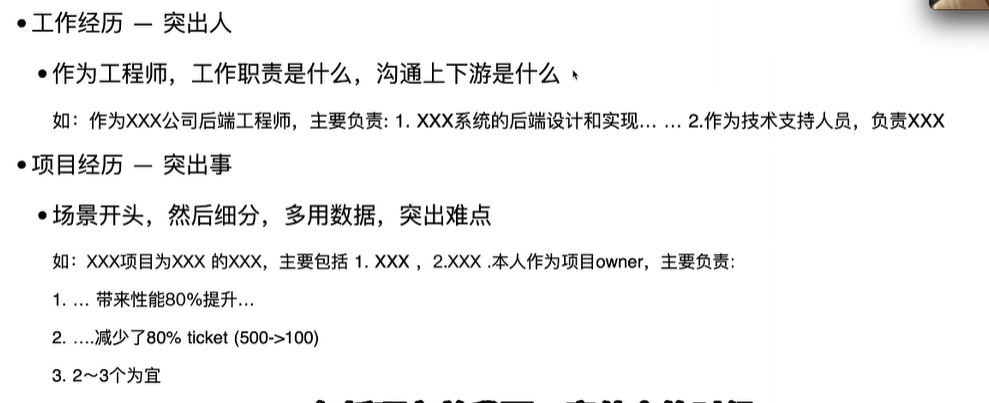
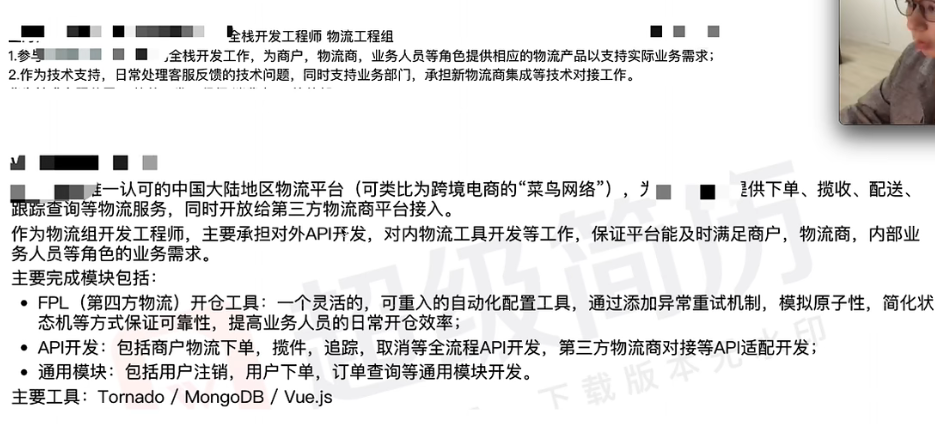
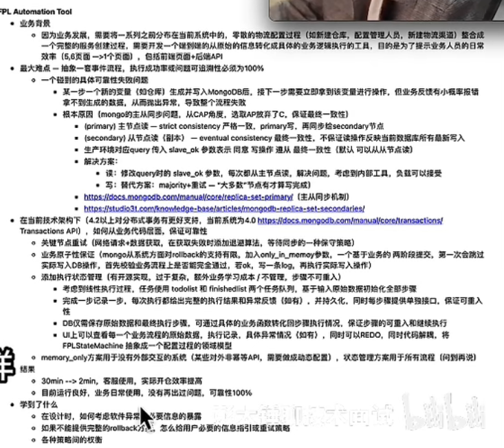

## 概述

### 项目介绍

#### 解决过最难的技术问题

#### 介绍需求是什么，问题如何产生

调研用到的技术是什么，用了什么解决方案，为什么选择这个解决方案

### 基础相关的问题

#### js基础

问到不熟的可以说我是背的，你要不要听

## 简历相关

#### 关键词

加上足够多、足够覆盖广的关键词帮助简历通过

#### 用于给面试官提供问题

让面试朝着我期望的方向

#### 包括

- 基本信息（联系方式、教育背景）
- 工作经历
- 项目经历
- 技术栈
- 体现技术能力的东西（开源项目）
- 以亮点为先排序

#### 项目

## 自我介绍

### 概览

目前在哪里，干什么

面对HR，需要突出业务价值

## 项目介绍

### 概览

最有成就感的项目

#### 技术价值

- STAR法则（大致即可）
- 用了什么技术
- 怎么实现的
- 花多少时间
- 提升了什么

#### 业务价值

- 给什么群体用的
- 给他们提供了什么价值

不要说和项目无关的废话，不要讲没准备的内容

## 项目经历准备

### 基本情况

- 创业公司
- 前端开发
- 约1年左右工作时间
- 业务开发：停车平台开发

### 具体梳理

- 系统是做什么的
- 我的角色是什么，我的价值是什么
- 具体细分模块，最后是技术细节

### 项目详情

### 其他

- 为什么不使用XX技术
- 用户增加会怎么样
- 如何性能优化